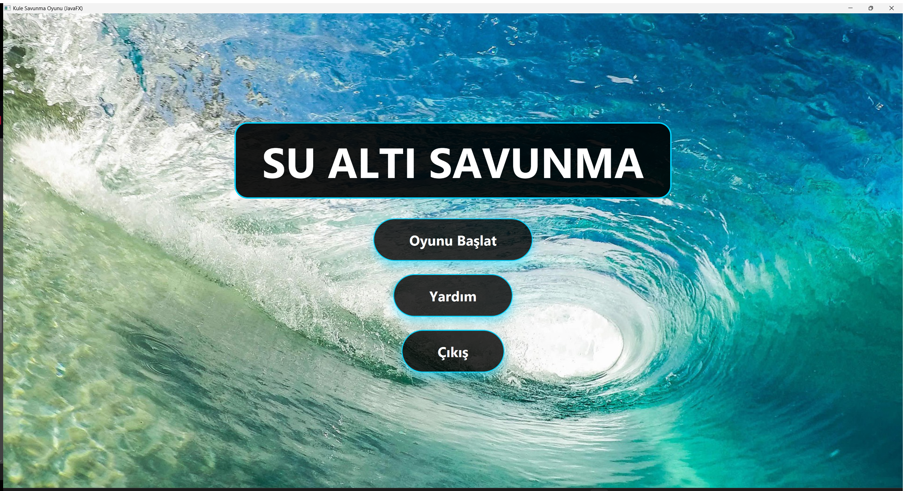
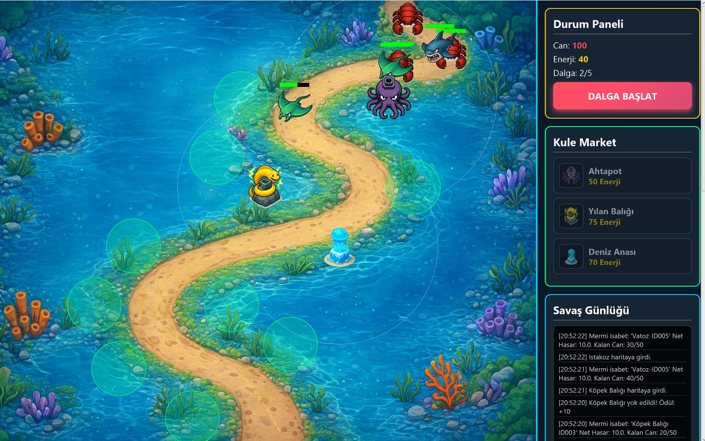
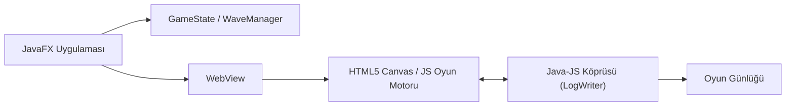

# Su Altı Savunma FX

Deniz canlısı temalı bir kule savunma (tower defense) oyunu. Oyun mantığı Java/JavaFX ile, oynanış ise JavaFX `WebView` içinde çalışan HTML5 Canvas/JS motoru ile gerçekleştirilir.



Gerçek oynanıştan bir kare — dalga yönetimi, kule marketi ve savaş günlüğü:



## Oynanış

- **Kuleler:** Ahtapot, Yılan Balığı, Deniz Anası (yavaşlatma etkili)
- **Düşmanlar:** Köpek Balığı (standart), Istakoz (zırhlı), Vatoz (uçan)
- Dalga (wave) yönetimi, altın ekonomisi
- `TowerFactory` / `EnemyFactory` ile nesne üretimi (Factory Method deseni)

## Mimari



- Java tarafı (`src/main/java`) oyun durumunu (`GameState`, `WaveManager`) yönetir ve `LogWriter` ile Java↔JS köprüsü üzerinden oyun günlüğünü diske yazar
- Asıl render/oynanış `src/main/resources/web/index.html` içindeki Canvas tabanlı JS motorunda çalışır, JavaFX `WebView` bunu barındırır

## Teknoloji

- Java 25, JavaFX (controls, fxml, web)
- Maven (`javafx-maven-plugin`)
- HTML5 Canvas / JavaScript

## Çalıştırma

```bash
mvn javafx:run
```

Windows'ta `start.bat` ile de çalıştırılabilir.
