# Su Altı Savunma

Deniz canlılarıyla oynanan bir kule savunma oyunu. Düşmanlar yoldan gelir, biz de yolun kenarına kule dikip üsse ulaşmalarını engelleriz. Oyun JavaFX ile masaüstünde çalışıyor, aynı oyunun Android ve tarayıcı sürümü de var.

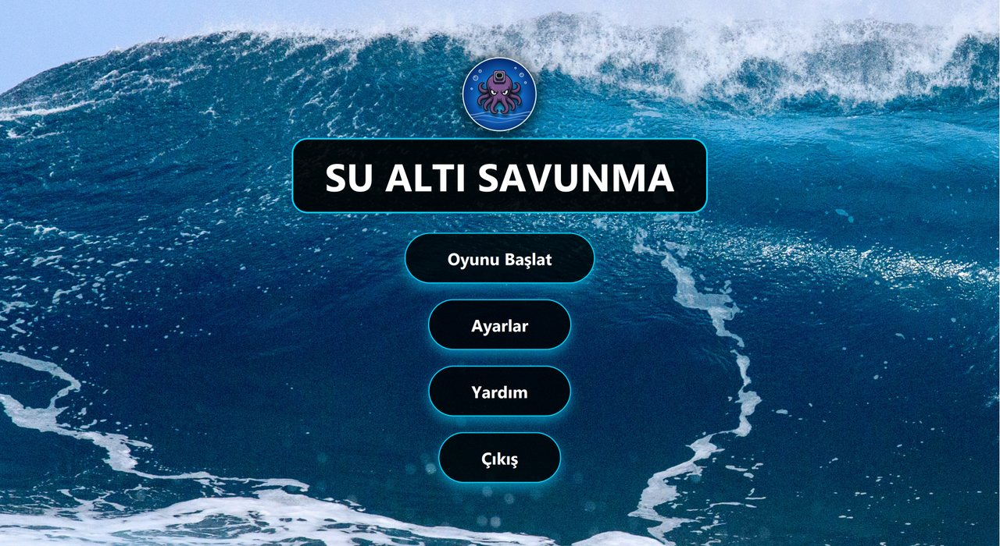

## İndirme

- [Android (APK)](https://github.com/CaptainGM/su-alti-savunma-fx/releases/latest/download/SuAltiSavunma.apk)
- [Windows (zip)](https://github.com/CaptainGM/su-alti-savunma-fx/releases/latest/download/SuAltiSavunma-Windows.zip)
- Eski sürümler: [Releases](https://github.com/CaptainGM/su-alti-savunma-fx/releases)

Telefondan okutmak için:


Windows için zip'i çıkarıp `SuAltiSavunma.exe` dosyasını açmak yeterli, Java kurmaya gerek yok. Android için APK'yı indirip açıyorsunuz, "bilinmeyen kaynaklardan yükleme" izni isteyebilir. Oyun yatay ekranda açılıyor.

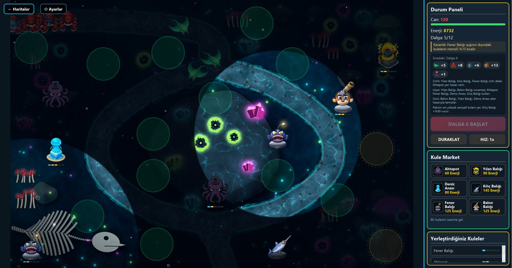

## Oyun

- 9 harita, her birinin yolu ve kendine ait bir kuralı var (yosun yavaşlatması, lav, kar fırtınası, karanlık gibi)
- 6 kule: Ahtapot, Yılan Balığı, Deniz Anası, Kılıç Balığı, Fener Balığı, Balon Balığı
- Kuleler 5 seviyeye kadar yükselir. 3. ve 5. seviyede iki yetenekten birini seçiyorsunuz, toplam 24 yetenek var
- Düşmanlar: köpek balığı, ıstakoz (zırhlı), vatoz (uçan), yavru köpek balıkları, ayrıca kalkanlı kaplumbağa, hayalet kalamar, şifacı denizatı ve elektrikli müren
- 4 çeşit patron var. Patronlar kuleyi yutabiliyor ve canları azaldıkça kalkan kazanıp hızlanıyor
- Zorluk kolay / normal / zor. Yarım kalan oyun kaydediliyor, haritayı bitirince sonsuz mod açılıyor
- Oyun içinde **Rehber** var: kuleleri, düşmanları ve harita kurallarını küçük gösterimlerle anlatıyor. Takılınca **İpucu** düğmesi (klavyede `H`) o dalgaya karşı hangi kulelerin iyi olduğunu söylüyor

Kulelerin hepsi aynı işi görmüyor. Mesela Ahtapot zırhlı düşmana az hasar veriyor, Yılan ve Balon Balığı uçan düşmanı vuramıyor, Deniz Anası düşmanı yavaşlatıp diğer kulelerin daha çok vurmasını sağlıyor. Hasarın çoğunu tek tür kuleye yaptırırsanız düşmanlar ona alışıyor, o yüzden türleri karıştırmak gerekiyor. Altın halkalı yüksek zeminlerde kule menzili %20 artıyor.

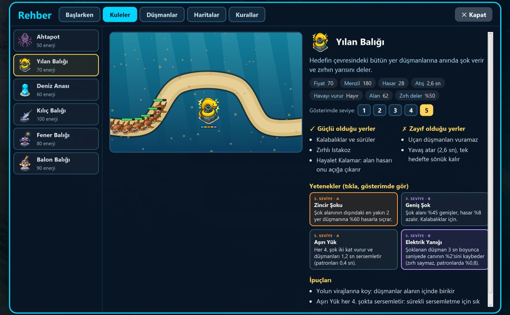

Kontroller: `Boşluk` dalga başlatır, `P` duraklatır, `F` hızı değiştirir, `1-6` kule seçer, `H` ipucu, `F11` tam ekran. Kuleyi sağdaki listeden haritadaki yeşil halkaya sürükleyerek kuruyorsunuz.

## Telefonda

Ekran küçük olunca yan panel yerine solda kule çubuğu, sağda dalga ve komut düğmeleri çıkıyor. Kuleyi parmakla sürükleyip bırakıyorsunuz, kuleye dokununca yükseltme ve satma penceresi açılıyor. Android'in geri tuşu açık pencereyi kapatıyor. Uygulama arka plana gidince oyun duruyor ve ses kesiliyor.

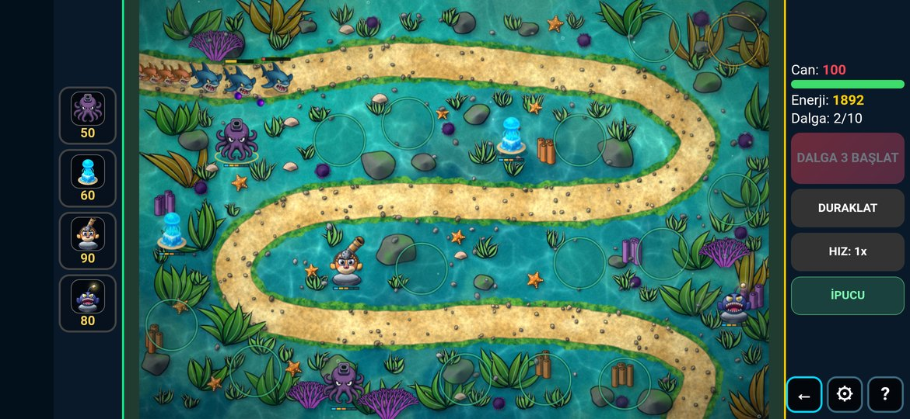

## Ekran görüntüleri

Masaüstü (resimlere tıklayınca büyüyor):

<table>
  <tr>
    <td align="center"><a href="docs/harita-secimi.jpg">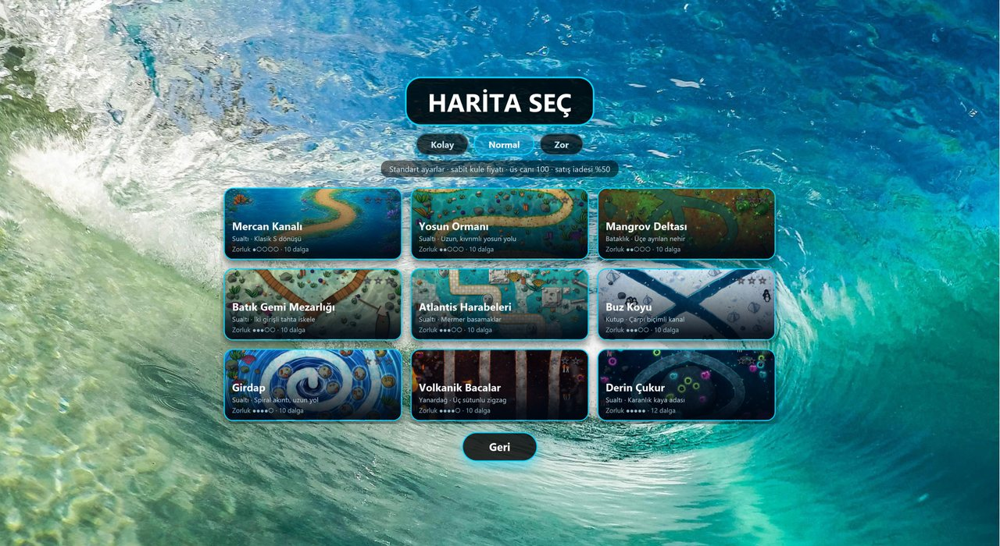</a><br><sub>Harita seçimi</sub></td>
    <td align="center"><a href="docs/kule-penceresi.jpg">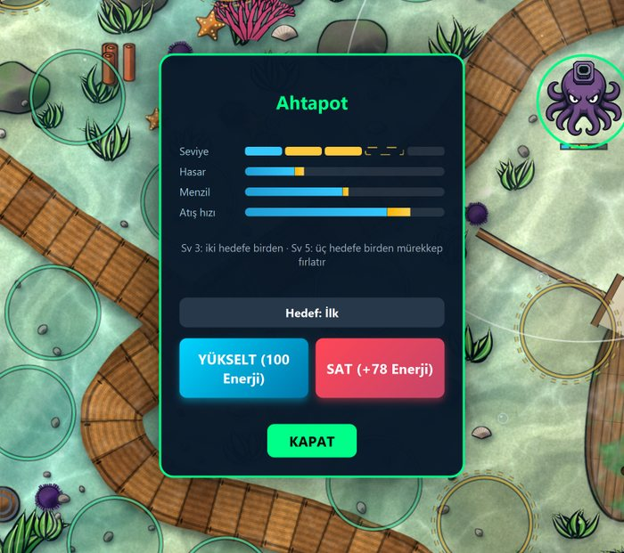</a><br><sub>Kule penceresi</sub></td>
    <td align="center"><a href="docs/yetenek-secimi.jpg">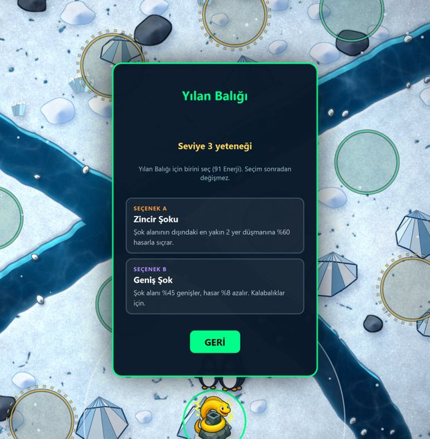</a><br><sub>Yetenek seçimi</sub></td>
  </tr>
  <tr>
    <td align="center"><a href="docs/patron-ziplama.jpg">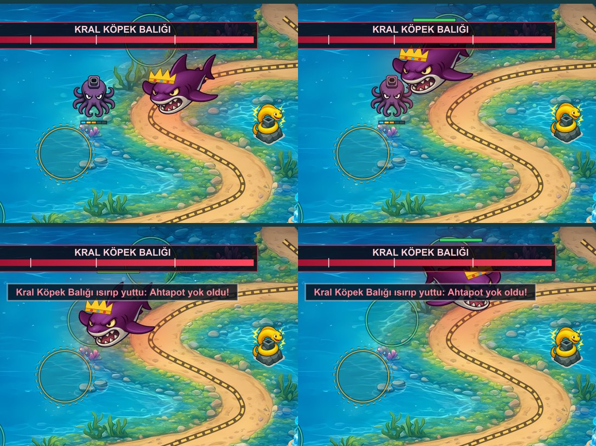</a><br><sub>Patron kuleyi yiyor</sub></td>
    <td align="center"><a href="docs/patron-evre.jpg">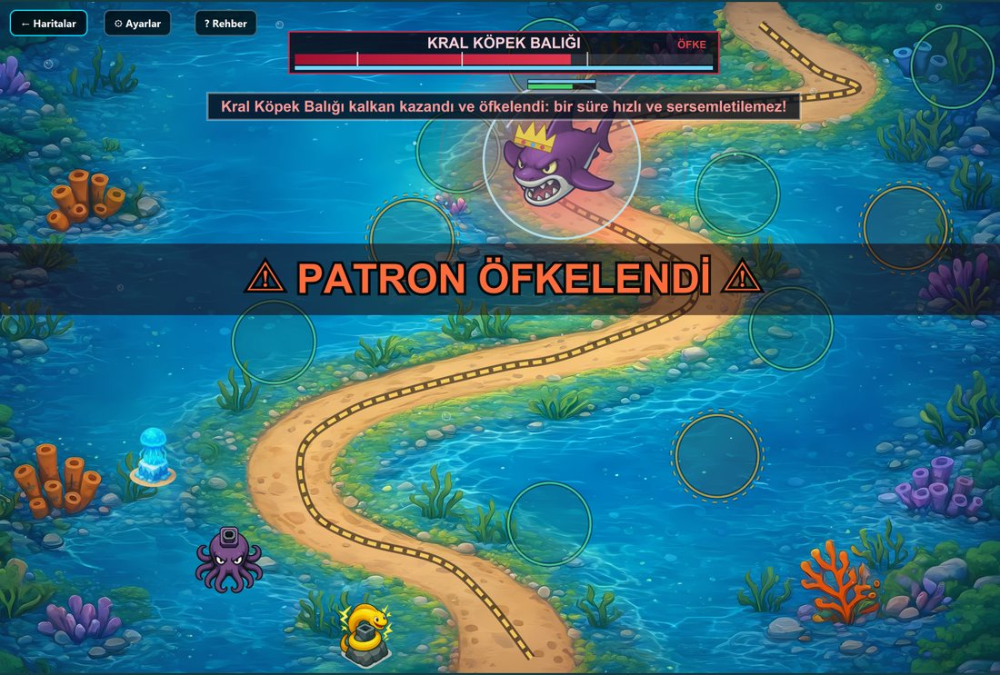</a><br><sub>Patron öfkelenince</sub></td>
    <td align="center"><a href="docs/yuksek-zemin-yazisi.jpg">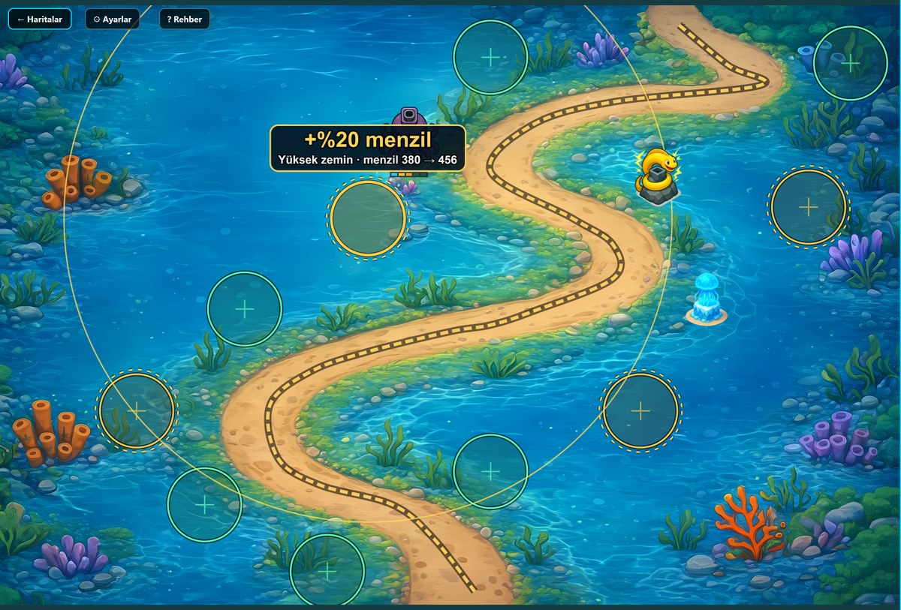</a><br><sub>Yüksek zemin</sub></td>
  </tr>
  <tr>
    <td align="center"><a href="docs/rehber-harita.jpg">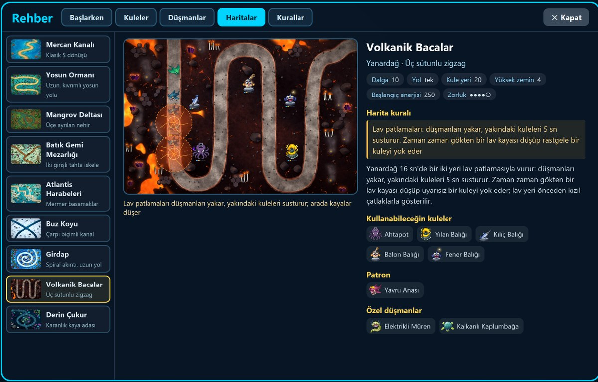</a><br><sub>Rehber: haritalar</sub></td>
    <td align="center"><a href="docs/rehber-yuksek-zemin.jpg">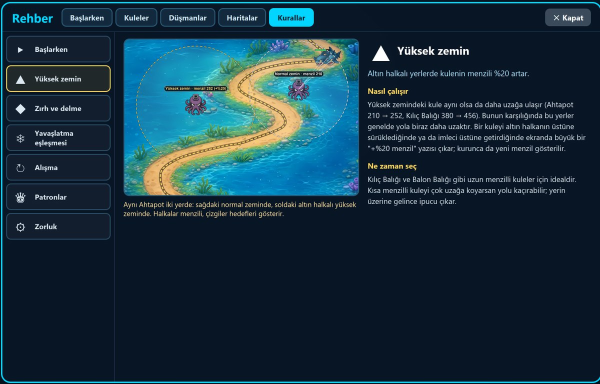</a><br><sub>Rehber: yüksek zemin</sub></td>
    <td align="center"><a href="docs/ipucu.jpg">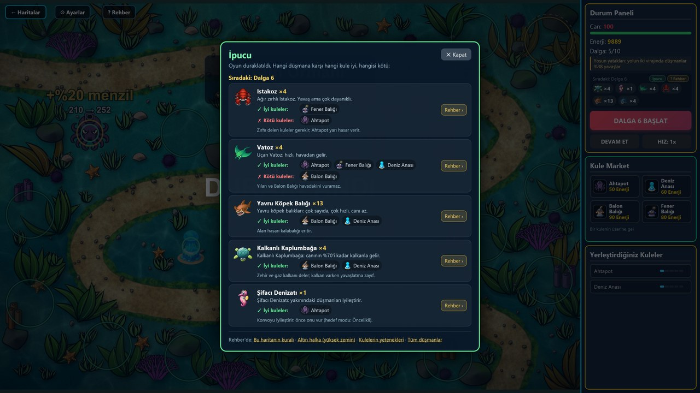</a><br><sub>İpucu penceresi</sub></td>
  </tr>
</table>

Android:

<table>
  <tr>
    <td align="center"><a href="docs/mobil-menu.jpg">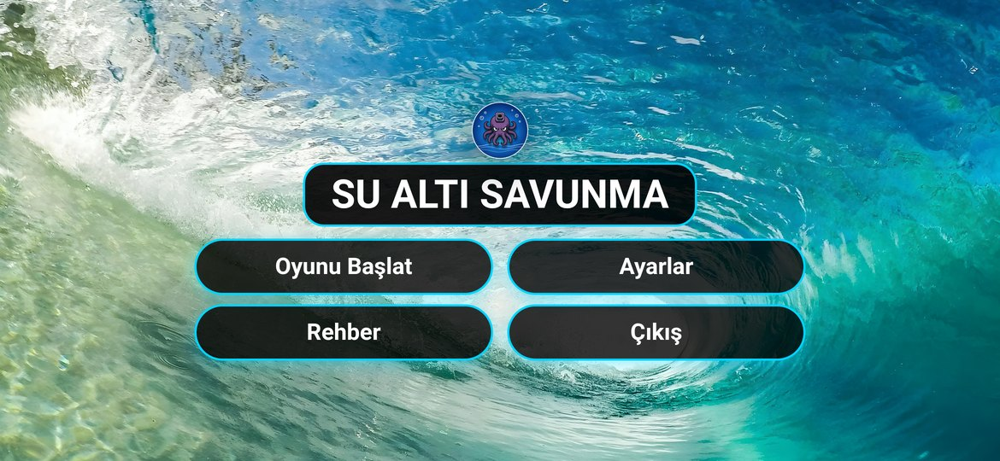</a><br><sub>Menü</sub></td>
    <td align="center"><a href="docs/mobil-harita.jpg">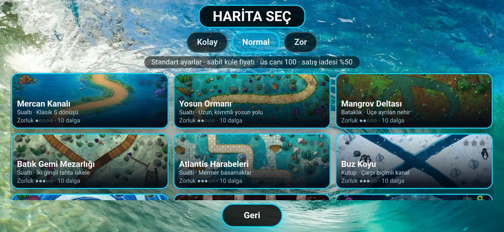</a><br><sub>Harita seçimi</sub></td>
    <td align="center"><a href="docs/mobil-kule.jpg">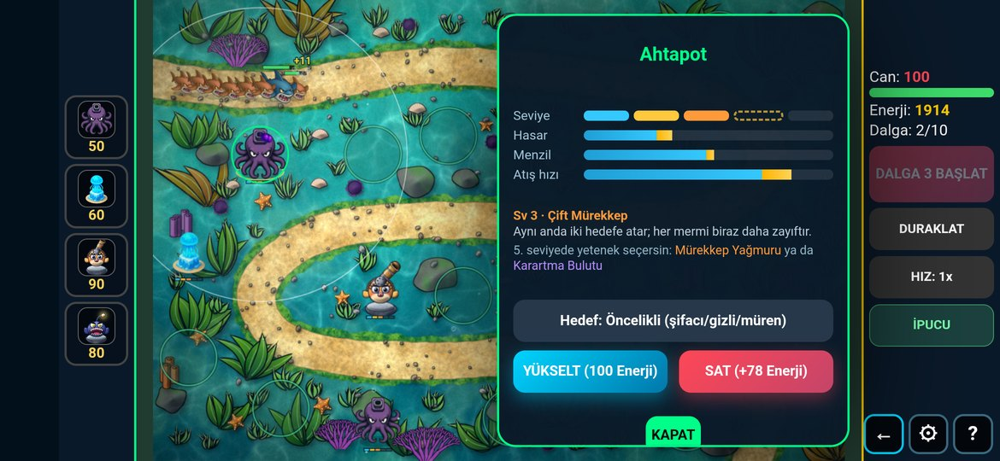</a><br><sub>Kule penceresi</sub></td>
  </tr>
  <tr>
    <td align="center"><a href="docs/mobil-ipucu.jpg">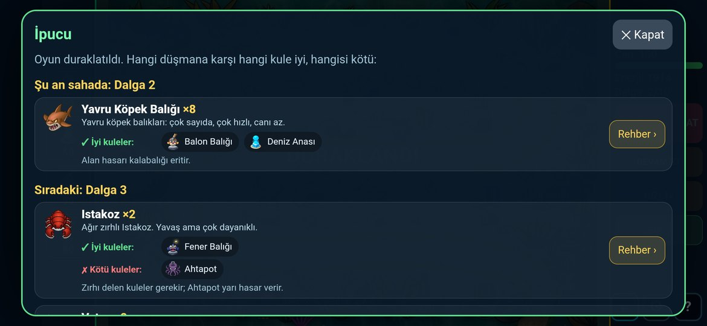</a><br><sub>İpucu</sub></td>
    <td align="center"><a href="docs/mobil-rehber.jpg">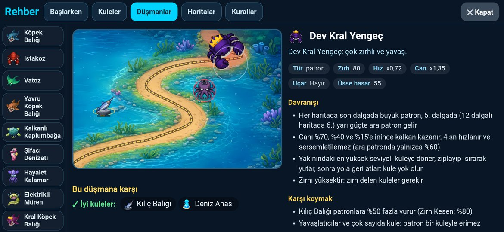</a><br><sub>Rehber</sub></td>
    <td align="center"><a href="docs/devam-et.jpg">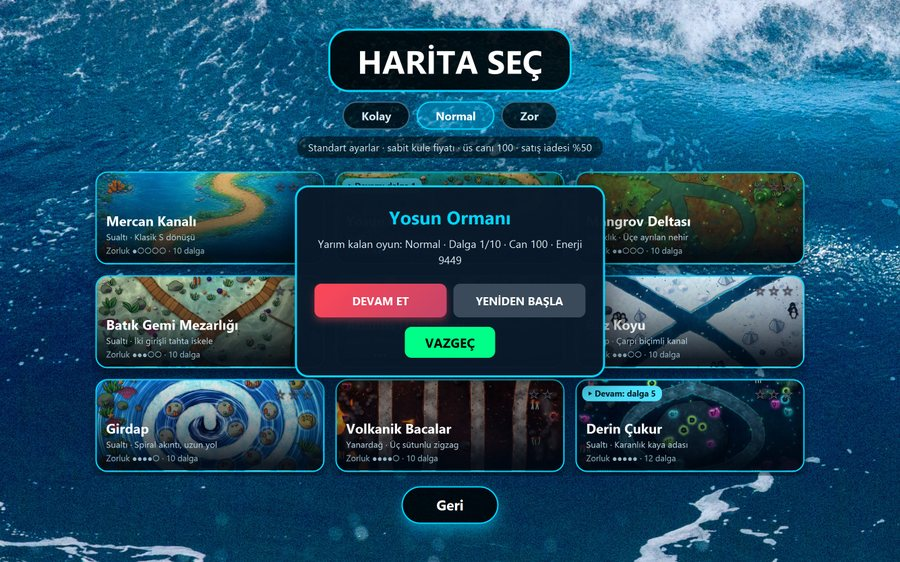</a><br><sub>Kayıtlı oyuna devam</sub></td>
  </tr>
</table>

## Çalıştırma

Masaüstü (Java 25 ve Maven gerekiyor):

```
mvn javafx:run
```

Windows'ta `start.bat` ile de açılıyor.

Tarayıcıda denemek için `src/main/resources/web` klasörünü bir web sunucusundan açmak yeterli. Elinizde Node varsa:

```
node tools/serve.js
```

Sonra `http://localhost:8080` adresine girin.

Android APK üretmek için `apk_uret.bat` dosyasını çalıştırın (Android Studio kurulu olmalı). İlk çalıştırmada imza anahtarını `android/anahtar` klasörüne oluşturuyor, APK `dist/SuAltiSavunma.apk` olarak çıkıyor. Anahtarı kaybetmeyin, yeni sürümler aynı anahtarla imzalanmazsa eski APK'nın üstüne kurulmuyor.

## Klasörler

- `src/main/java`: JavaFX uygulaması (pencere, ses, kayıt dosyası, günlük)
- `src/main/resources/web`: oyunun kendisi (HTML, CSS, JavaScript). Masaüstü, Android ve tarayıcı sürümü aynı dosyaları kullanıyor
  - `core.js`: oyun kuralları (düşmanlar, kuleler, dalgalar), ekrana dokunmuyor
  - `game.js`: çizim ve arayüz
  - `maps.js`: harita verileri
  - `rehber.js`: Rehber ekranı
  - `ses_dsp.js`, `audio.js`: ses ve müzik (tarayıcı ve Android için)
- `android`: Android uygulaması (sadece web dosyalarını gösteren küçük bir WebView)
- `tools`: denge testleri, harita ve sprite üretim betikleri, testler
- `docs`: README resimleri

Sesler ve müzik dosya olarak durmuyor, kodla üretiliyor (`SoundBank.java`, `MusicEngine.java`). Tarayıcı ve Android sürümü için aynısı JavaScript'e çevrildi.

## Testler

```
node tools/test_core.js          oyun kuralları
node tools/zorluk_testi.js       botlarla zorluk kontrolü (uzun sürüyor)
node tools/dayaniklilik.js hizli uzun süre oynatıp çökme arıyor
node tools/ses_karsilastir.js    JS sesleri Java sesleriyle aynı mı
node tools/e2e/calistir.js       tarayıcıda telefon ve masaüstü testleri (Playwright)
node tools/e2e/android.js        APK'yı emülatörde dener
```

E2E testleri için `tools/e2e` içinde `npm install` ve `npx playwright install chromium` gerekiyor. Bu testlerin çoğu GitHub Actions'ta da her push'ta çalışıyor.

Haritaların zorluğu (`hpScale`, `bossScale`) `tools/balans.js` ve `tools/ayar.js` ile botlara oynatılarak ayarlandı.

## Yeni sürüm çıkarma

`pom.xml` içindeki sürümü artırıp push etmek yeterli. GitHub Actions Windows zip'ini ve APK'yı derleyip Releases sayfasına koyuyor.

## Notlar

- JavaFX WebView'da WebGL ve Web Audio yok, bu yüzden çizim 2B canvas ile yapıldı, masaüstünde ses Java tarafından çalınıyor
- WebView'ın kendi animasyon döngüsü 60 FPS'e takılıyor, kareleri Java'daki zamanlayıcı sürüyor
- Geniş alana yayılan tek bir çizim yolu (örneğin ekran boyu kar çizgileri) bu WebView'da FPS'i yarıya düşürüyor, o yüzden küçük çizimler önceden hazırlanıp basılıyor
- Menü arka planı bir dalga fotoğrafının Real-ESRGAN ile büyütülmüş hali
