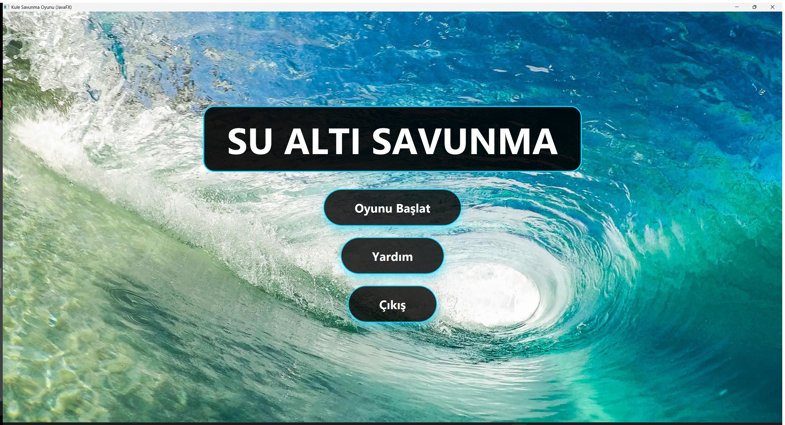
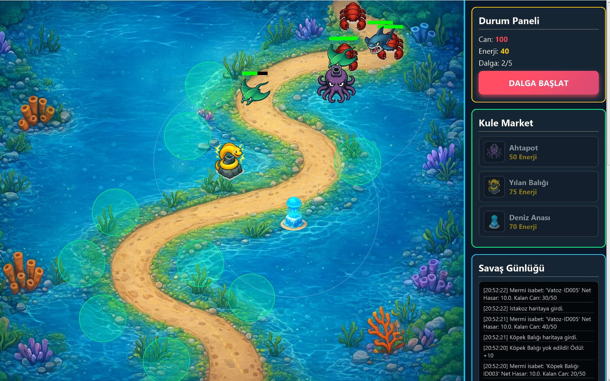
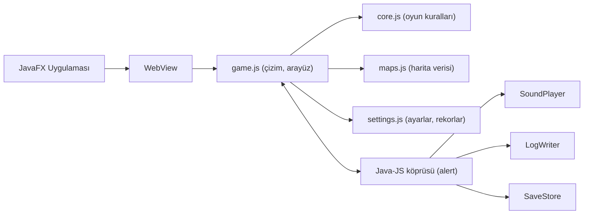

# Su Altı Savunma FX

Deniz canlısı temalı bir kule savunma (tower defense) oyunu. Uygulama JavaFX ile açılır, oyun ise `WebView` içinde çalışan HTML5 Canvas/JS motoruyla oynanır.



Gerçek oynanıştan bir kare — dalga yönetimi, kule marketi ve savaş günlüğü:



## Oynanış

- **9 harita**, her birinin yolu ve atmosferi farklı (aşağıdaki tabloya bak)
- **6 kule türü**, her harita bunlardan 4-6 tanesini sunar:
  - Ahtapot: hızlı, havayı da vurur, zırhlıya zayıf
  - Yılan Balığı: alan şoku, zırh deler, havayı vuramaz
  - Deniz Anası: yavaşlatır
  - Kılıç Balığı: çok uzun menzilli keskin nişancı, hedefe dönerek nişan alır, patronlara %50 fazla hasar
  - Fener Balığı: destek kulesi, yakınındaki kulelere hasar ve atış hızı verir
  - Balon Balığı: havan, hedefin gideceği yere atar, kümelere alan hasarı
- **Düşmanlar:** Köpek Balığı, Istakoz (zırhlı), Vatoz (uçan), Yavru Köpek Balığı (hızlı sürü) ve 4 çeşit patron: Kral Köpek Balığı, Dev Kral Yengeç (çok zırhlı), Manta İmparatoru (uçan), Yavru Anası (yarı canda yavru saçar)
- Kule fiyatı aynı türden her kuleyle %12 artar, kule başına 5 seviye vardır (3. ve 5. seviyede yetenek açılır)
- **Altın halkalı** yerler yüksek zemindir: menzil %20 artar
- Kule başına hedef önceliği: İlk / Son / En Güçlü / En Yakın
- Dalga bonusu, sıradaki dalga önizlemesi, duraklat, 2x hız
- **Sonsuz mod:** haritayı kazanınca devam edilebilir, patronlar döngüyle gelir, rekor kaydedilir
- Zorluk seçimi (harita ekranında altında neyin değiştiği yazar):

| | Kolay | Normal | Zor |
|---|---|---|---|
| Düşman canı | -%20 | standart | +%12 |
| Düşman hızı | -%5 | standart | +%4 |
| Başlangıç enerjisi | +%30 | standart | -%8 |
| Öldürme ödülü | +%10 | standart | -%5 |
| Dalga bonusu | +%20 | standart | -%10 |
| Üs canı | 130 | 100 | 85 |
| Satış iadesi | %60 | %50 | %40 |

- Kısayollar: `Boşluk` dalga başlat, `P` duraklat, `F` hız, `1-5` kule seç, `F11` tam ekran, `Esc` geri

## Ayarlar

Ana menüden ya da oyun içindeki **Ayarlar** düğmesinden: efekt sesi ve sessiz mod, tam ekran, pencere boyutu (1280x720'den 2K'ya), görüntü kalitesi, ortam efektleri ve hasar yazılarını kapatma. Ayarlar ve harita rekorları `~/.su-alti-savunma/kayit.json` dosyasına yazılır.

## Haritalar

Her haritanın yolu farklı olduğu gibi kendine özel bir kuralı da var. Kural harita açılırken ve sağ paneldeki durum kutusunda yazar.

| Harita | Yol | Özel kural |
|---|---|---|
| Mercan Kanalı | tek, S dönüşlü | yok (başlangıç haritası) |
| Yosun Ormanı | tek, uzun yılan | işaretli yosun yataklarında düşmanlar %38 yavaşlar |
| Mangrov Deltası | nehir üçe ayrılır, sonra birleşir | kök bölgesinde düşmanlar %30 yavaşlar |
| Batık Gemi Mezarlığı | iki girişli, ortada birleşir | sandık ara sıra parlar, **tıklayıp** altın toplarsın |
| Atlantis Harabeleri | mermer basamaklar | 3 taş koruyucu baş her 10 sn düşmanlara vurup sersemletir |
| Buz Koyu | iki kanal ortada çapraz geçer | kar fırtınası (önceden uyarır): 9 sn boyunca kule menzilleri %25 kısalır |
| Girdap | spiral | yolun ikinci yarısında düşmanlar girdaba çekilip hızlanır |
| Volkanik Bacalar | üç sütunlu dikey zigzag | lav patlamaları (önceden uyarır): düşmanı yakar, yakındaki kuleleri 2,5 sn susturur |
| Derin Çukur | ikiye ayrılıp birleşir, 12 dalga | karanlık: Fener Balığı'nın ışığı dışındaki kulelerin menzili %15 kısalır |

## Mimari


```mermaid
flowchart LR
    APP[JavaFX Uygulaması] --> WV[WebView]
    WV --> UI["game.js (çizim, arayüz)"]
    UI --> CORE["core.js (oyun kuralları)"]
    UI --> MAPS["maps.js (harita verisi)"]
    UI --> SET["settings.js (ayarlar, rekorlar)"]
    UI <--> BR["Java-JS köprüsü (alert)"]
    BR --> SND[SoundPlayer]
    BR --> LOG[LogWriter]
    BR --> SAVE[SaveStore]
```

- `core.js` DOM'a dokunmaz: düşmanlar, kuleler, dalga planı, ekonomi. Aynı dosya Node'da denge ve birim testleri için de kullanılır
- `game.js` çizimi, efektleri, sesi ve arayüzü yönetir; `core.js`'den gelen olaylara tepki verir
- `maps.js` yeni harita eklemek için tek yerdir (yol, kule yerleri, hangi kuleler, patron türü, zorluk, ortam efektleri)
- Java tarafı pencereyi açar, tam ekranı ve pencere boyutunu yönetir, sesi çalar (`SoundPlayer`), günlüğü (`LogWriter`) ve ayar/rekor dosyasını (`SaveStore`) yazar
- `model/` paketindeki sınıflar (`Tower`, `Enemy`, `WaveManager`...) nesne yönelimli tasarımın Java karşılığıdır ancak şu an çalışan oyun döngüsüne bağlı değildir; oyun kuralları JS tarafındadır ve model katmanından çok daha kapsamlıdır
- JavaFX `WebView` WebGL ve Web Audio desteklemez; bu yüzden 3B (Three.js) kullanılamıyor, çizim 2B Canvas ile yapılıyor. Ayrıca `globalCompositeOperation = 'lighter'` bu WebView'da tuvali siliyor, CSS `blur()` filtresi ise büyük pencerede sayfayı tamamen beyaz bırakıyor (`RTTexture` hatası); ikisi de kullanılmıyor ve `node tools/test_core.js` bunları denetliyor. Görsel değişikliklerden sonra mutlaka gerçek pencerede `mvn javafx:run` ile de bakın, Chrome'da çalışan her şey WebView'da çalışmaz

## Ses

Sesler dosyadan değil kodla üretilir (`SoundBank.java`): alçak "tok" vuruş, filtrelenmiş gürültü ve ton katmanları. `SoundPlayer` tek bir ses hattı üzerinde yazılımsal bir mikserle çalar. Sesler tepe değerine göre değil insan kulağına göre (A-ağırlıklı) ses düzeyine normalize edilir ve hafif doygunluk uygulanır; böylece alçak sesler kulaklıkta da duyulur. Her sesin düzeyi `SoundBank` içindeki `LEVEL` tablosundan ayarlanır, ayarlardaki ses çubuğu %150'ye kadar çıkar. Patron geldiğinde uyarı sesi, ekranda kırmızı titreşim, patron ayaktayken hızlanan kalp atışı ve ölünce ekran sarsıntısı vardır.

Tüm sesleri WAV olarak yazmak ve düzeylerini görmek için:

```bash
java -cp target/classes com.kule.savunma.SoundBank sesler
```

## Teknoloji

- Java 25+, JavaFX (controls, fxml, web)
- Maven (`javafx-maven-plugin`)
- HTML5 Canvas / JavaScript

## Çalıştırma

```bash
mvn javafx:run
```

Windows'ta `start.bat` ile de çalıştırılabilir. Geliştirirken `-Dsavunma.hash="#map=2&diff=hard"` ile doğrudan bir haritayı açabilirsiniz.

## Araçlar

```bash
node tools/test_core.js              # oyun çekirdeği denetimleri
node tools/balans.js                 # botlarla denge simülasyonu (tüm haritalar)
node tools/balans.js cukur hard      # tek harita ve zorluk
node tools/balans.js "" all          # üç zorluk birden
python tools/mapgen/build.py         # harita arka planlarını ve önizlemelerini yeniden üretir
python tools/mapgen/export_js.py --write   # yol ve kule yerlerini maps.js'e yazar
python tools/sprites/build.py        # kule, mermi ve patron sprite'larını üretir (Kılıç Balığı kaide ve dönen balık olarak ayrı)
python tools/sprites/logo.py         # logo ve uygulama simgesi
```

Harita arka planları ve yeni sprite'lar `tools` altındaki Python betikleriyle üretilir (numpy, scipy, Pillow gerekir); arka planlar 2700x1800 çözünürlüktedir.
Kendi çizdiğiniz ya da bir görsel üreticiyle oluşturduğunuz bir arka planı kullanmak için `maps.js`'e yeni bir
harita nesnesi eklemeniz ve `paths` ile `buildSpots` koordinatlarını (1350x900 tuvale göre) yazmanız yeterlidir.
