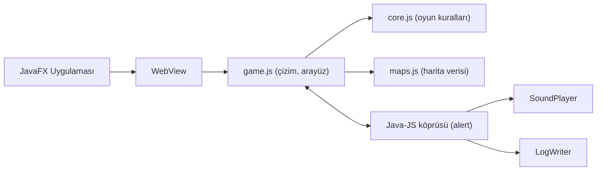

# Su Altı Savunma FX

Deniz canlısı temalı bir kule savunma (tower defense) oyunu. Uygulama JavaFX ile açılır, oyun ise `WebView` içinde çalışan HTML5 Canvas/JS motoruyla oynanır.


Gerçek oynanıştan bir kare — dalga yönetimi, kule marketi ve savaş günlüğü:


## Oynanış

- **Kuleler:** Ahtapot (hızlı, havayı da vurur, zırhlıya zayıf), Yılan Balığı (alan şoku, zırh deler, havayı vuramaz), Deniz Anası (yavaşlatır)
- **Düşmanlar:** Köpek Balığı, Istakoz (zırhlı), Vatoz (uçan), Yavru Köpek Balığı (hızlı sürü), Kral Köpek Balığı (patron)
- Kule fiyatı aynı türden her kuleyle %12 artar, kule başına 5 seviye vardır (3. ve 5. seviyede yetenek açılır)
- **Altın halkalı** yerler yüksek zemindir: menzil %20 artar
- Her kuleye hedef önceliği seçilebilir (İlk / Son / En Güçlü / En Yakın)
- Dalga bonusu, sıradaki dalga önizlemesi, duraklat ve 2x hız
- Zorluk: Kolay / Normal / Zor, her harita için 1-3 yıldız kaydı
- Kısayollar: `Boşluk` dalga başlat, `P` duraklat, `F` hız, `1-2-3` kule seç, `Esc` geri

## Haritalar

| Harita | Yol | Not |
|---|---|---|
| Mercan Kanalı | tek, S dönüşlü | başlangıç haritası |
| Yosun Ormanı | tek, uzun yılan | iki sıra arasındaki yerler iki yolu birden vurur |
| Batık Gemi Mezarlığı | iki girişli, ortada birleşir | tahta iskele yolu |
| Girdap | spiral | hızlı sürüler, uzun yol |
| Derin Çukur | ikiye ayrılıp birleşir | ortadaki adadan iki kol da vurulur, 12 dalga |
| Yıldız Filosu, Kum Krallığı | tek | eski haritalar, 3 düşman türüyle |

## Mimari


```mermaid
flowchart LR
    APP[JavaFX Uygulaması] --> WV[WebView]
    WV --> UI["game.js (çizim, arayüz)"]
    UI --> CORE["core.js (oyun kuralları)"]
    UI --> MAPS["maps.js (harita verisi)"]
    UI <--> BR["Java-JS köprüsü (alert)"]
    BR --> SND[SoundPlayer]
    BR --> LOG[LogWriter]
```

- `core.js` DOM'a dokunmaz: düşmanlar, kuleler, dalga planı, ekonomi. Aynı dosya Node'da denge testi için de kullanılır
- `game.js` çizimi, efektleri, sesi ve arayüzü yönetir; `core.js`'den gelen olaylara tepki verir
- `maps.js` yeni harita eklemek için tek yerdir (yol, kule yerleri, zorluk, ortam efektleri)
- Java tarafı pencereyi açar, sesi çalar (`SoundPlayer`) ve günlüğü diske yazar (`LogWriter`)
- `model/` paketindeki sınıflar (`Tower`, `Enemy`, `WaveManager`...) nesne yönelimli tasarımın Java karşılığıdır ancak şu an çalışan oyun döngüsüne bağlı değildir; oyun kuralları JS tarafındadır
- JavaFX `WebView` WebGL ve Web Audio desteklemez; bu yüzden 3B (Three.js) kullanılamıyor, çizim 2B Canvas ile yapılıyor. Ayrıca `globalCompositeOperation = 'lighter'` bu WebView'da tuvali sildiği için kullanılmıyor

## Teknoloji

- Java 25+, JavaFX (controls, fxml, web)
- Maven (`javafx-maven-plugin`)
- HTML5 Canvas / JavaScript

## Çalıştırma

```bash
mvn javafx:run
```

Windows'ta `start.bat` ile de çalıştırılabilir. Geliştirirken `-Dsavunma.hash="#map=2&diff=hard"` ile doğrudan bir haritayı açabilirsiniz.

## Araçlar

```bash
node tools/balans.js                 # botlarla denge simülasyonu (tüm haritalar)
node tools/balans.js cukur hard      # tek harita ve zorluk
python tools/mapgen/build.py         # yeni sualtı harita arka planlarını yeniden üretir
python tools/mapgen/export_js.py     # yol ve kule yerlerini maps.js için yazdırır
python tools/sprite_varyant.py       # yavru ve kral köpek balığı sprite'larını üretir
```

Harita arka planları `tools/mapgen` altındaki Python betikleriyle üretilir (numpy, scipy, Pillow gerekir).
Kendi çizdiğiniz ya da bir görsel üreticiyle oluşturduğunuz bir arka planı kullanmak için `maps.js`'e yeni bir
harita nesnesi eklemeniz ve `paths` ile `buildSpots` koordinatlarını (1100x900 tuvale göre) yazmanız yeterlidir.
