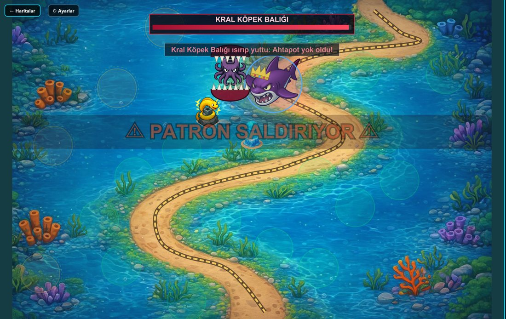
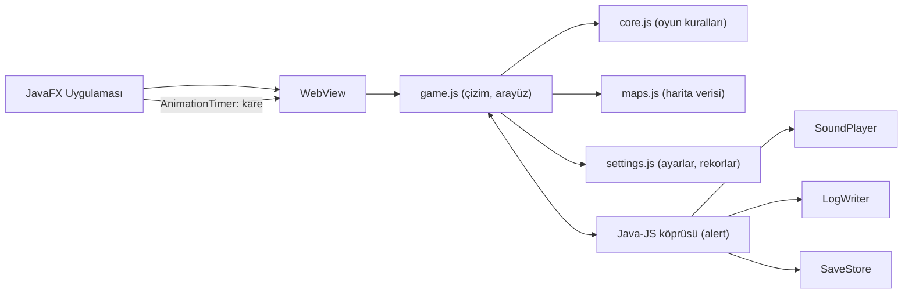

# Su Altı Savunma FX

Deniz canlısı temalı bir kule savunma (tower defense) oyunu. Uygulama JavaFX ile açılır, oyun ise `WebView` içinde çalışan HTML5 Canvas/JS motoruyla oynanır.


Derin Çukur haritasından bir kare: Fener Balıkları karanlığı aydınlatıyor, sağ üstteki kutu sıradaki dalgaya karşı hangi kulelerin işe yarayacağını söylüyor.


## Oynanış

- **9 harita**, her birinin yolu, atmosferi ve özel kuralı farklı (aşağıdaki tabloya bak). Her haritada 15-25 kule yeri vardır; hepsi yola yetişir (yol kıvrımlarının iç tarafları dahil) ve harita boyunca dengeli dağılır. Yola yakın yerler kısa menzilli kulelere uyar, biraz daha uzak yüksek (altın halkalı) yerlerin menzili %20 artar
- **6 kule türü**, her harita bunlardan 4-6 tanesini sunar:
  - Ahtapot: hızlı, havayı da vurur, zırhlıya çok zayıf
  - Yılan Balığı: alan şoku, zırh deler, havayı vuramaz
  - Deniz Anası: yavaşlatır; yavaşlayan düşman her kuleden %20 fazla hasar alır
  - Kılıç Balığı: çok uzun menzilli keskin nişancı, hedefe dönerek nişan alır, patronlara %50 fazla hasar
  - Fener Balığı: dengeli bir kule; karanlık haritada (Derin Çukur) çevresini aydınlatır, ışığındaki kuleler menzil kaybetmez. Işıkları birleşir, kesişen yer karanlık kalmaz
  - Balon Balığı: havan, sırtındaki namlu düşmana döner, hedefin gideceği yere atar, kümelere alan hasarı
- **Düşmanlar:** Köpek Balığı, Istakoz (ağır zırhlı), Vatoz (uçan), Yavru Köpek Balığı (hızlı sürü) ve 4 çeşit patron: Kral Köpek Balığı, Dev Kral Yengeç (çok zırhlı), Manta İmparatoru (uçan), Yavru Anası (yarı canda yavru saçar)
- Kule başına 5 seviye vardır (3. ve 5. seviyede yetenek açılır). Seviye ve güç değerleri sayı yerine çubukla gösterilir: mavi mevcut değer, sarı yükseltmeyle gelecek kazanç
- Kule fiyatları birbirine yakındır: Ahtapot 50, Deniz Anası 60, Yılan Balığı 70, Fener Balığı 80, Balon Balığı 90, Kılıç Balığı 100. Fiyat kolay ve normalde sabit kalır, yalnızca zorda aynı türden her yeni kule %6 pahalanır. Başlangıç enerjisi yuvarlak sayıdır: kolay 300, normal 250, zor 200 (Derin Çukur'da 50 fazla)
- **Yarım kalan oyun kaydedilir:** haritalara dönünce ya da oyunu kapatınca durum (dalga, can, enerji, kuleler, ekrandaki düşmanlar) kaydedilir; haritaya tekrar tıklayınca *Devam et* ya da *Yeniden başla* seçilir. Her harita için bir kayıt tutulur, oyun bitince silinir
- Kule başına hedef önceliği: İlk / Son / En Güçlü / En Yakın
- Dalga bonusu, sıradaki dalga önizlemesi, duraklat, **0,5x / 1x / 2x** hız
- **Sonsuz mod:** haritayı kazanınca devam edilebilir, patronlar döngüyle gelir, rekor kaydedilir


### Strateji gerekir

Kuleleri rastgele dizip parayı bitirmek kazandırmaz; botlarla yapılan denge testinde rastgele oynayan da tek türe yığılan da normal zorlukta neredeyse hiç kazanamıyor. Dikkat edilmesi gerekenler:

- **Dalga içeriği:** zırhlı Istakozlara Ahtapot çok az hasar verir (zırh delen Yılan, Kılıç ve Fener Balığı gerekir), uçan Vatozları Yılan ve Balon Balığı vuramaz, sürüyü alan hasarı eritir. Sağ üstteki kutu sıradaki dalganın içeriğini ve işe yarayan kuleleri yazar, yalnızca o haritadaki kuleleri önerir
- **Alışma:** 4. dalgadan sonra hasarın yarısından fazlasını tek bir türe yaptırırsan düşmanlar ona alışır ve o türden en fazla %25 az hasar alır. Kutuda turuncu "Düşmanlar alıştı: Ahtapot %25 daha az hasar veriyor" uyarısı çıkar, türleri karıştırınca alışma kalkar
- **Eşleşme:** Deniz Anası ile yavaşlatılan düşman her kuleden %20 fazla hasar alır
- **Yer seçimi:** menzil ve yer birlikte düşünülür. Altın halkalı yüksek zeminde menzil %20 artar ama bu yerler yola uzaktır
- **Patron kuleyi yer:** patron zaman zaman yakınındaki en yüksek seviyeli kuleye yönelir, önce çenesini açar (kırmızı çene ve çizgi görünür), sonra kuleyi **yutar**. Yutulan kule yok olur, para iadesi yoktur. Patron saldırı sırasında ölürse kule yenmez. Patron gelirken ekranda uyarı, can çubuğu ve kalp atışı sesi vardır



### Zorluk

Zorluk seçimi harita ekranında, altında neyin değiştiği yazar:

| | Kolay | Normal | Zor |
|---|---|---|---|
| Düşman canı | -%10 | standart | +%6 |
| Düşman hızı | -%3 | standart | +%3 |
| Başlangıç enerjisi | 300 | 250 | 200 |
| Aynı türden kule fiyatı | sabit | sabit | her kule +%6 |
| Öldürme ödülü | +%8 | standart | -%3 |
| Dalga bonusu | +%15 | standart | -%5 |
| Üs canı | 120 | 100 | 90 |
| Satış iadesi | %60 | %50 | %45 |

Her haritanın düşman canı (`hpScale`) `node tools/balans.js` ile ayrı ayrı ayarlanmıştır: normal zorlukta düzenli dizilen bir oyuncu kazanır, rastgele dizen kaybeder.

- Kısayollar: `Boşluk` dalga başlat, `P` duraklat, `F` hız (1x, 2x, 0,5x), `1-6` kule seç, `F11` tam ekran, `Esc` geri


Yarım kalan bir haritaya tıklayınca:


## Haritalar

Her haritanın yolu farklı olduğu gibi kendine özel bir kuralı da var. Kural harita açılırken ve sağ paneldeki durum kutusunda yazar.

| Harita | Yol | Özel kural |
|---|---|---|
| Mercan Kanalı | tek, S dönüşlü | yok (başlangıç haritası) |
| Yosun Ormanı | tek, uzun yılan | yolun iki virajındaki yosun yataklarında düşmanlar %38 yavaşlar |
| Mangrov Deltası | nehir üçe ayrılır, sonra birleşir | kök bölgesinde düşmanlar %30 yavaşlar |
| Batık Gemi Mezarlığı | iki girişli, ortada birleşir | sandık ara sıra parlar, **tıklayıp** altın toplarsın |
| Atlantis Harabeleri | mermer basamaklar | 3 mermer koruyucu küre her 10 sn düşmanlara vurup sersemletir (dolum arttıkça parlar) |
| Buz Koyu | iki kanal ortada çapraz geçer | kar fırtınası (önceden uyarır): 9 sn boyunca kule menzilleri %25 kısalır |
| Girdap | spiral | yolun ikinci yarısında düşmanlar girdaba çekilip hızlanır |
| Volkanik Bacalar | üç sütunlu dikey zigzag | lav patlamaları (önceden uyarır): düşmanı yakar, yakındaki kuleleri 5 sn susturur (kilit simgesi çıkar). Zaman zaman gökten bir lav kayası düşer ve uyarısız bir kuleyi yok eder |
| Derin Çukur | ikiye ayrılıp birleşir, 12 dalga | karanlık: Fener Balığı'nın ışığı dışındaki kulelerin menzili %15 kısalır, ışığın dışı görünür biçimde kararır |

## Ayarlar

Ana menüden ya da oyun içindeki **Ayarlar** düğmesinden: efekt sesi ve sessiz mod, tam ekran, pencere boyutu (1280x720'den 2K'ya), görüntü kalitesi, **hedef FPS** (60 / 120 / 144 / 240 / 360 / sınırsız, varsayılan 120), FPS sayacı, ortam efektleri ve hasar yazılarını kapatma. Ayarlar, harita rekorları ve yarım kalan oyunlar `~/.su-alti-savunma/kayit.json` dosyasına yazılır (önce geçici dosyaya yazılıp yerine taşınır). Uygulama bu dosyayı tek kaynak olarak kullanır; WebView'ın kendi yerel deposu bilerek okunmaz, böylece ses gibi ayarlar başka bir çalıştırmadan eski değerle geri gelmez. Varsayılan ses %60'tır. Ses sürgüsü 0-100 arasıdır; tüm seslerin genel düzeyi `SoundBank.MASTER_DB` ile birlikte kısılıp açılabilir.

### Akıcılık (FPS)

JavaFX `WebView`'ın kendi `requestAnimationFrame` döngüsü 60 FPS'e kilitlidir. Bu yüzden kareleri Java tarafındaki `AnimationTimer` sürer (`window.javaFrame`), hedef FPS ayarı da bunun üzerinde uygulanır. Asıl yük tuval çizimindeydi ve şunlarla azaltıldı: sprite'lar çizileceği boyuta bir kez küçültülüp önbelleğe alınır (500 piksellik resmi her karede küçültmek kare başına ~0,6 ms tutuyordu), karanlık haritanın gölgesi ve ışık huzmeleri arka plana bir kez pişirilir, boş kule yerleri küçük sprite olarak çizilir, ışık ağı tek katmandır, ray yolu arka plana pişirilir. Tuvalin iç çözünürlüğü ekrana göre 2700 piksele kadar çıkar (arka planlar 2700x1800'dür); Mercan Kanalı'nın eski 1536 piksellik arka planı da aynı boyuta büyütülüp keskinleştirildi. Sınırsız FPS'te, 12 yükseltilmiş kule ve çalışan bir dalga ile gerçek uygulamada (tam ekran) ölçülen değerler haritalara göre yaklaşık 150-350 FPS'tir; Mercan Kanalı'nın kesikli ray yolu da her karede çizilmek yerine arka plana pişirilince en yavaş harita olmaktan çıktı. Varsayılan 120 sınırı tüm haritalarda tutuyor. Ayarlardan FPS sayacını açıp kendi bilgisayarınızda görebilirsiniz.

## Oyun günlüğü

Savaş günlüğü arayüzde gösterilmez. Her oyun için `loglar/<harita>_<tarih>.txt` dosyası açılır (ör. `loglar/Mercan-Kanali_2026-10-01_18-45-49.txt`) ve inşa, yükseltme, isabet, öldürme, patron saldırısı gibi olaylar oyun sürerken bu dosyaya akar; oyun bitince özet rapor eklenir. `loglar/` klasörü git'e girmez.

## Mimari


```mermaid
flowchart LR
    APP[JavaFX Uygulaması] --> WV[WebView]
    APP -- "AnimationTimer: kare" --> WV
    WV --> UI["game.js (çizim, arayüz)"]
    UI --> CORE["core.js (oyun kuralları)"]
    UI --> MAPS["maps.js (harita verisi)"]
    UI --> SET["settings.js (ayarlar, rekorlar)"]
    UI <--> BR["Java-JS köprüsü (alert)"]
    BR --> SND[SoundPlayer]
    BR --> LOG[LogWriter]
    BR --> SAVE[SaveStore]
```

- `core.js` DOM'a dokunmaz: düşmanlar, kuleler, dalga planı, ekonomi, patron saldırısı, alışma, harita kuralları. Aynı dosya Node'da denge ve birim testleri için de kullanılır
- `game.js` çizimi, efektleri, sesi ve arayüzü yönetir; `core.js`'den gelen olaylara tepki verir
- `maps.js` yeni harita eklemek için tek yerdir (yol, kule yerleri, hangi kuleler, patron türü, zorluk, ortam efektleri)
- Java tarafı pencereyi açar, kare döngüsünü sürer, tam ekranı ve pencere boyutunu yönetir, sesi çalar (`SoundPlayer`), günlüğü (`LogWriter`) ve ayar/rekor dosyasını (`SaveStore`) yazar
- `model/` paketindeki sınıflar (`Tower`, `Enemy`, `WaveManager`...) nesne yönelimli tasarımın Java karşılığıdır ancak şu an çalışan oyun döngüsüne bağlı değildir; oyun kuralları JS tarafındadır ve model katmanından çok daha kapsamlıdır
- JavaFX `WebView` WebGL ve Web Audio desteklemez; bu yüzden 3B (Three.js) kullanılamıyor, çizim 2B Canvas ile yapılıyor. Ayrıca `globalCompositeOperation = 'lighter'` bu WebView'da tuvali siliyor, CSS `blur()` filtresi ise büyük pencerede sayfayı tamamen beyaz bırakıyor (`RTTexture` hatası), başlangıç noktasız `ellipse` yayları da yol çiziciyi hataya düşürüyor; bunlar kullanılmıyor ve `node tools/test_core.js` ilk ikisini denetliyor. Görsel değişikliklerden sonra mutlaka gerçek pencerede `mvn javafx:run` ile de bakın, Chrome'da çalışan her şey WebView'da çalışmaz

## Ses

Sesler dosyadan değil kodla üretilir (`SoundBank.java`): alçak "tok" vuruş, filtrelenmiş gürültü ve ton katmanları. `SoundPlayer` tek bir ses hattı üzerinde yazılımsal bir mikserle çalar. Sesler tepe değerine göre değil insan kulağına göre (A-ağırlıklı) ses düzeyine normalize edilir ve hafif doygunluk uygulanır; böylece alçak sesler kulaklıkta da duyulur. Her sesin düzeyi `SoundBank` içindeki `LEVEL` tablosundan ayarlanır, ayarlardaki ses çubuğu bunun üzerine uygulanır. Patron geldiğinde uyarı sesi, ekranda kırmızı titreşim, patron ayaktayken hızlanan kalp atışı, kule yenirken çene çatırtısı ve ölünce ekran sarsıntısı vardır.

Tüm sesleri WAV olarak yazmak ve düzeylerini görmek için:

```bash
java -cp target/classes com.kule.savunma.SoundBank sesler
```

## Görsel kaynakları

- Menü arka planı: Johannes Andersson'ın dalga fotoğrafı ([Unsplash](https://unsplash.com/photos/v5gGwubKzEA), Wikimedia Commons üzerinden CC0), sol bölümü kırpılıp 2560x1440'a getirildi
- Harita arka planları `tools/mapgen` betikleriyle üretilir; Mercan Kanalı'nın arka planı özgün resmin 2700x1800'e büyütülmüş halidir
- Kule, düşman ve patron sprite'ları `tools/sprites` betikleriyle üretilir

## Yapılabilecekler

Proje bu haliyle tamamlanmış sayılır; devam edilmek istenirse sırasıyla şunlar en çok değer katar:

1. **Kule yetenek seçimi:** 3. seviyede iki yetenekten birini seçmek (ör. Ahtapot: çift mermi ya da zırh delen mürekkep). Aynı kuleyle farklı oyun tarzları açar
2. **Yeni düşman davranışları:** iyileştiren, kalkan taşıyan, kulenin ışığından kaçıp gizlenen düşmanlar; böylece "tek tür yığmak" ve "hep aynı dizilim" daha da cezalanır
3. **Özel güçler:** dalga başına bir kez kullanılan bomba, dondurma ya da onarım gibi tıklanabilir yetenekler
4. **İlerleme ve günlük meydan okuma:** yıldızla açılan kuleler/haritalar, başarımlar, sabit tohumlu günlük harita ve yerel skor tablosu
5. **Ses ve atmosfer:** haritaya özel ortam müziği ve su altı sesleri (şimdiki sesler kodla üretiliyor, müzik yok)
6. **Erişilebilirlik:** renk körü paleti, yazı boyutu ayarı, tamamen klavyeyle oynama, İngilizce dil seçeneği
7. **Harita editörü:** yol ve kule yerlerini tuvalde çizip `maps.js` çıktısı veren küçük bir araç (şimdi Python betikleri ve elle koordinat gerekiyor)
8. **Otomatik denetim ve dağıtım:** GitHub Actions ile `node tools/test_core.js` ve `mvn compile`, `jpackage` ile Windows kurulum dosyası; kullanılmayan `model/` paketinin kaldırılması

## Teknoloji

- Java 25+, JavaFX (controls, fxml, web)
- Maven (`javafx-maven-plugin`)
- HTML5 Canvas / JavaScript

## Çalıştırma

```bash
mvn javafx:run
```

Windows'ta `start.bat` ile de çalıştırılabilir. Geliştirirken `-Dsavunma.hash="#map=2&diff=hard"` ile doğrudan bir haritayı açabilirsiniz; `-Duser.home=<klasör>` ile kayıt dosyası başka bir yere alınır (testlerde gerçek ayarlara dokunmamak için). `-Dsavunma.perf=true` ile saniyedeki kare sayısı ve kare başına betik süresi konsola yazılır.

## Araçlar

```bash
node tools/test_core.js              # oyun çekirdeği denetimleri
node tools/balans.js                 # botlarla denge simülasyonu (tüm haritalar)
node tools/balans.js cukur hard      # tek harita ve zorluk
node tools/balans.js "" all          # üç zorluk birden
BOTS=rastgele,karisik SEEDS=11,23,37,41,59 node tools/balans.js yosun   # bot ve tohum seçimi
python tools/mapgen/build.py         # harita arka planlarını ve önizlemelerini yeniden üretir
python tools/mapgen/export_js.py --write   # yolları (ve ilk kule yerlerini) maps.js'e yazar
python tools/mapgen/spots.py         # kule yerlerinin dağılımını önizler (tools/mapgen/spots_preview/)
python tools/mapgen/spots.py --write # yolu kapsamayan yerleri siler, boş bölgelere yer ekleyip maps.js'e yazar
python tools/sprites/build.py        # kule, mermi ve patron sprite'larını üretir
python tools/sprites/logo.py         # logo ve uygulama simgesi
```

Denge botları: `spam` her yere tek tür dizer, `rastgele` türü, yeri ve yükseltmeyi rastgele seçip parayı bitirir, `karisik` türleri sırayla kullanıp en iyi yerlere dizer, `akilli` bunu sıradaki dalganın içeriğine göre uyarlar. Amaç `spam` ve `rastgele` normal zorlukta kaybederken `karisik`ın kazanmasıdır; yeni bir harita ya da kural eklerken `hpScale` buna göre ayarlanır.

`spots.py` her yeri üç kurala göre denetler: yolun eksenine en az 80 piksel uzakta olmalı, normal yer en çok 185, yüksek zemin en çok 235 piksel uzakta olabilir ve en kısa menzilli kuleyle (200 piksel) yolun en az 150 pikselini kapsamalı. Kurallara uyan elle yerleştirilmiş yerleri korur, uymayanları siler, yola yakın bölgelerde ~170 pikselden büyük boşluk kalmayacak biçimde viraj içleri gibi yolu çok kapsayan noktalara yeni yerler ekler ve arka planın en karmaşık bölgelerinden (iskelet, kristal öbeği) kaçınır. `export_js.py` kule yerlerini de yeniden yazdığı için sırayla çalıştırılmalıdır: önce `export_js.py --write`, sonra `spots.py --write`.

Harita arka planları ve yeni sprite'lar `tools` altındaki Python betikleriyle üretilir (numpy, scipy, Pillow gerekir); arka planlar 2700x1800 çözünürlüktedir.
Kendi çizdiğiniz ya da bir görsel üreticiyle oluşturduğunuz bir arka planı kullanmak için `maps.js`'e yeni bir
harita nesnesi eklemeniz ve `paths` ile `buildSpots` koordinatlarını (1350x900 tuvale göre) yazmanız yeterlidir.
