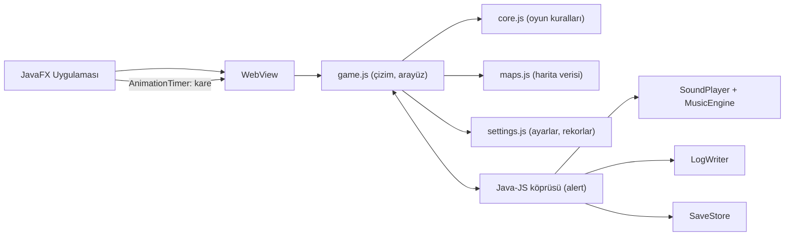

# Su Altı Savunma FX

Deniz canlısı temalı bir kule savunma (tower defense) oyunu. Uygulama JavaFX ile açılır, oyun ise `WebView` içinde çalışan HTML5 Canvas/JS motoruyla oynanır.


Derin Çukur haritasından bir kare: Fener Balıkları karanlığı aydınlatıyor, kulelerin altındaki renkli çubuklar seviyeyi ve seçilen yetenekleri gösteriyor, sağ üstteki kutu sıradaki dalgaya karşı hangi kulelerin işe yarayacağını söylüyor. Ekranda şifacı denizatı ve vatozlar var.


## Rehber

Menüdeki **Rehber** düğmesi (oyun içinde sol üstteki **? Rehber** ve sağ paneldeki **? Rehber**) canlı gösterimli bir yardım ekranı açar. Gösterimler gerçek oyun kurallarıyla ve **gerçek harita resimleri üzerinde** çalışır: seçtiğin kule, seviye ve yetenekle Mercan Kanalı'nın S dönüşünde düşmanlara ateş eder; Haritalar sekmesinde ise seçtiğin haritanın tamamı küçültülmüş canlı hâliyle görünür. Gösterimler oyundaki gibi Java zamanlayıcısıyla çizilir (150+ FPS); altta duran ekranın sürekli yeniden boyanması Rehber'i 30 FPS'e düşürüyordu, açıkken gizlenir.

- **Kuleler:** her kule için güçlü ve zayıf olduğu yerler, istatistikler, seviye düğmeleri ve 4 yetenek. Bir yeteneğe tıklayınca gösterimde o seviye ve o yetenekle kule çalışır (zincir şoku, gaz bulutu, kritik vuruş, ışık ağı...)
- **Düşmanlar:** 4 temel tür, 4 özel tür ve 4 patron; kalkanın kırılması, şifacının iyileştirmesi, kalamarın gizlenmesi, mürenin kule sersemletmesi, patronun kuleyi yemesi canlı izlenir. Her sayfada o düşmana karşı iyi (✓) ve kötü (✗) kuleler gösterilir
- **Haritalar:** 9 haritanın her biri için kuralın ayrıntılı anlatımı (sayılarıyla), kullanılabilen kuleler, patron ve özel düşmanlar; haritanın kendisi küçültülmüş ve canlı: gerçek yolda yürüyen düşmanlar, gerçek kule yerlerindeki kuleler ve kuralın kendisi (lav, fırtına, girdap, koruyucu küreler, hazine, karanlık, sarmaşık)
- **Kurallar:** yüksek zemin (menzil halkalarıyla), zırh ve delme, yavaşlatma eşleşmesi, alışma (hasar payı grafiğiyle), patronlar ve zorluk tablosu
- **İpucu düğmesi:** sağ panelde yazı duvarı yoktur; takılan oyuncu **İpucu** düğmesine (ya da `H` tuşuna) basar. Açılan pencere o an sahadaki ve sıradaki dalgadaki her tehlikeli düşman için ne yaptığını, hangi kulelerin iyi (✓) ve hangilerinin kötü (✗) olduğunu adlarıyla yazar; "Rehber ›" düğmesi ilgili düşman sayfasını açar. Üsse düşman geçince İpucu düğmesi göz kırpar (başarısız oldukça öğrenilsin diye ilk geçişte ekranda küçük bir hatırlatma çıkar). Pencere açıkken oyun duraklar


## Oynanış

- **9 harita**, her birinin yolu, atmosferi ve özel kuralı farklı (aşağıdaki tabloya bak). Her haritada 15-25 kule yeri vardır; hepsi yola yetişir (yol kıvrımlarının iç tarafları dahil) ve harita boyunca dengeli dağılır. Yola yakın yerler kısa menzilli kulelere uyar, biraz daha uzak yüksek (altın halkalı) yerlerin menzili %20 artar
- **6 kule türü**, her harita bunlardan 4-6 tanesini sunar:
  - Ahtapot: hızlı, havayı da vurur, zırhlıya çok zayıf
  - Yılan Balığı: hedefe parlak bir elektrik topu fırlatır, top varınca alan şoku patlar; zırh deler, havayı vuramaz
  - Deniz Anası: yavaşlatır; yavaşlayan düşman her kuleden %20 fazla hasar alır
  - Kılıç Balığı: çok uzun menzilli keskin nişancı (temel hasar 40), hedefe dönerek nişan alır, patronlara %50 fazla hasar
  - Fener Balığı: dengeli bir kule; karanlık haritada (Derin Çukur) çevresini aydınlatır, ışığındaki kuleler menzil kaybetmez. Işıkları birleşir, kesişen yer karanlık kalmaz
  - Balon Balığı: havan, sırtındaki namlu düşmana döner, hedefin gideceği yere atar, kümelere alan hasarı
- **Düşmanlar (9 tür):** Köpek Balığı, Istakoz (ağır zırhlı), Vatoz (uçan), Yavru Köpek Balığı (hızlı sürü) ve haritaya göre sırayla gelen **özel düşmanlar**; ayrıca 4 çeşit patron (aşağıda). Özel düşmanlar dalga ilerledikçe, her biri farklı bir kule yeteneğini ya da dizilişi gerektirecek şekilde belirir:
  - **Kalkanlı Kaplumbağa** (3. dalgadan): canının %70'i kadar kalkanı var, önce kalkanı erir; zehir ve gaz kalkanı deler, kalkan varken yavaşlatma zayıf kalır. Çiftler halinde yürür
  - **Hayalet Kalamar** (4. dalgadan): belli aralıkla gizlenir ve kuleler onu göremez. Fener Balığı'nın ışığı ya da alan hasarı (Yılan, Balon Balığı) onu ortaya çıkarır. Tek sıra halinde, hızlı gelir
  - **Şifacı Denizatı** (5. dalgadan): yakınındaki düşmanları iyileştirir. Konvoyun ortasında yürür; önce onu vurmak gerekir
  - **Elektrikli Müren** (6. dalgadan): yakınındaki kuleyi uyarı verdikten sonra 3,5 sn sersemletir. Dalganın son üçte birinde gelir, uzaktan vurulur ya da yavaşlatılır
- Kule başına 5 seviye vardır. **3. ve 5. seviyeye çıkarken iki yetenekten birini seçersin** (6 kule x 4 seçim = 24 yetenek, aşağıda). Seviye ve güç değerleri sayı yerine çubukla gösterilir: mavi mevcut değer, sarı yükseltmeyle gelecek kazanç, turuncu ve mor dilimler seçtiğin yetenek
- Kule fiyatları birbirine yakındır: Ahtapot 50, Deniz Anası 60, Yılan Balığı 70, Fener Balığı 80, Balon Balığı 90, Kılıç Balığı 100. Fiyat kolay ve normalde sabit kalır, yalnızca zorda aynı türden her yeni kule %5 pahalanır. Başlangıç enerjisi yuvarlak sayıdır: kolay 300, normal 250, zor 230 (Derin Çukur ve Buz Koyu'nda 50 fazla)
- **Yarım kalan oyun kaydedilir:** haritalara dönünce ya da oyunu kapatınca durum (dalga, can, enerji, kuleler, ekrandaki düşmanlar) kaydedilir; haritaya tekrar tıklayınca *Devam et* ya da *Yeniden başla* seçilir. Her harita için bir kayıt tutulur, oyun bitince silinir
- Kule başına hedef önceliği: **Öncelikli** (şifacı, gizlenen ve müreni önce seçer, yoksa İlk gibi davranır) / İlk / Son / En Güçlü / En Yakın
- Dalga bonusu, sıradaki dalga önizlemesi, duraklat, **0,5x / 1x / 2x** hız
- **Sonsuz mod:** haritayı kazanınca devam edilebilir, patronlar döngüyle gelir, rekor kaydedilir

### Kule yetenekleri

Yükselt düğmesi 3. ve 5. seviyede seçim paneli açar. Seçim kalıcıdır, aynı kuleyle farklı oyun tarzları çıkar:

 

| Kule | 3. seviye (A / B) | 5. seviye (A / B) |
|---|---|---|
| Ahtapot | Çift Mürekkep: iki hedef / Delici Mürekkep: zırhın %40'ını deler, zırhlıya ceza yok | Mürekkep Yağmuru: bir hedef daha, daha hızlı / Karartma Bulutu: vurduğunu 4 sn işaretler, herkes %20 fazla vurur |
| Yılan Balığı | Zincir Şoku: alan dışındaki 2 düşmana sıçrar / Geniş Şok: alan %45 büyür | Aşırı Yük: her 4. şok iki kat vurur ve sersemletir / Elektrik Yanığı: şoklananı 3 sn yakar (zırh saymaz) |
| Deniz Anası | Buz Dokunuşu: %65 yavaşlatır, 4,5 sn / Zehirli Dokunuş: 4 sn zehir | Elektrikli Su: yakındakileri de yavaşlatır / Derin Nabız: her 6. atışta menzildeki herkesi yavaşlatır |
| Kılıç Balığı | Zırh Kesen: zırhı deler, patrona %80 fazla / Keskin Nişan: %25 kritik, menzil +%10 | Av Başı: canı %30'un altındakine iki kat / Kılıç Yağmuru: her 5. atış en güçlü 3 düşmana |
| Fener Balığı | Aydınlık Çevre: ışık %40 büyür, ışığındaki kuleler +%10 hasar / Odak Işığı: menzil +%20, hasar +%25 | Şafak Ağı: ışıktaki düşmanlar %12 yavaş / Çifte Işık: iki hedef, daha hızlı |
| Balon Balığı | Büyük Patlama: alan +%35, hasar +%15 / Hızlı Namlu: %35 daha sık atar | Zehirli Gaz: patlama yerinde 3,5 sn gaz bulutu / Yapışkan Sıvı: patlamadakiler 3 sn %50 yavaş |


### Strateji gerekir

Kuleleri rastgele dizip parayı bitirmek kazandırmaz; botlarla yapılan denge testinde rastgele oynayan da tek türe yığılan da normal zorlukta neredeyse hiç kazanamıyor. Dikkat edilmesi gerekenler:

- **Dalga içeriği:** zırhlı Istakozlara Ahtapot çok az hasar verir (zırh delen Yılan, Kılıç ve Fener Balığı gerekir), uçan Vatozları Yılan ve Balon Balığı vuramaz, sürüyü alan hasarı eritir. Sağ üstteki kutu sıradaki dalganın içeriğini ve işe yarayan kuleleri yazar, yalnızca o haritadaki kuleleri önerir
- **Alışma:** 4. dalgadan sonra hasarın yarısından fazlasını tek bir türe yaptırırsan düşmanlar ona alışır ve o türden en fazla %25 az hasar alır. Kutuda turuncu "Düşmanlar alıştı: Ahtapot %25 daha az hasar veriyor" uyarısı çıkar, türleri karıştırınca alışma kalkar
- **Eşleşme:** Deniz Anası ile yavaşlatılan düşman her kuleden %20 fazla hasar alır
- **Yer seçimi:** menzil ve yer birlikte düşünülür. Altın halkalı yüksek zeminde menzil %20 artar ama bu yerler yola uzaktır. Bir kuleyi altın halkaya sürüklediğinde ya da imleci üstüne getirdiğinde ekranda büyük bir "+%20 menzil" etiketi (ve o kulenin normal / yüksek menzili) çıkar, kurunca menzil halkası genişleyerek yeni menzili gösterir


- **Özel düşmanlar:** zehir ve gaz kalkanı deler (Deniz Anası B, Balon Balığı 5. seviye A); alan hasarı ve Fener Balığı ışığı gizlenenleri ortaya çıkarır; şifacıyı "Öncelikli" modla önce vur; müreni uzaktan (Kılıç Balığı) ya da yavaşlatarak karşıla. İlk göründüklerinde ekranda kısa bir bilgi çıkar
- **Patron evreleri:** büyük patronun canı %70, %40 ve %15'e inince (ara patronda %60'a inince) patron maksimum canının %12'si kadar **kalkan** kazanır, 4 sn hızlanır ve sersemletilemez. Patron çubuğunda bu eşikler çizgi olarak görünür. Böylece tek bir güçlü kuleyle (ör. 3. seviye Kılıç Balığı) patron yolun başında eritilemez
- **Patron kuleyi yer:** patron zaman zaman yakınındaki en yüksek seviyeli kuleyi hedef alır: kızıl bir halka kuleyi işaretler, patron yürürken kuleye döner ve çömelir; 1,4 sn sonra kule yutulur ve yok olur (para iadesi yoktur). Bu süreç hep aynıdır; görüntüsü ise şöyledir: patron son yarım saniyede **ağzı kuleye dönük olarak üstüne zıplar**, ısırıp yutar, çiğner ve yola (o an bulunduğu yer) geri atlar. Patron yutmadan ölürse kule yenmez. Patron gelirken ekranda uyarı, can çubuğu ve kalp atışı sesi vardır


Canı bir eşikten inen patron kalkan kazanıp öfkelenir (kızıl hale, hız çizgileri, mavi kalkan çubuğu):


### Zorluk

Zorluk seçimi harita ekranında, altında neyin değiştiği yazar:

| | Kolay | Normal | Zor |
|---|---|---|---|
| Düşman canı | -%10 | standart | +%3 |
| Düşman hızı | -%3 | standart | +%1,5 |
| Başlangıç enerjisi | 300 | 250 | 230 |
| Aynı türden kule fiyatı | sabit | sabit | her kule +%5 |
| Öldürme ödülü | +%8 | standart | -%2 |
| Dalga bonusu | +%15 | standart | -%3 |
| Üs canı | 120 | 100 | 95 |
| Satış iadesi | %60 | %50 | %45 |

Her haritanın düşman canı (`hpScale`) `node tools/balans.js` ile ayrı ayrı ayarlanmıştır: normal zorlukta düzenli dizilen bir oyuncu kazanır, rastgele dizen kaybeder.

- Kısayollar: `Boşluk` dalga başlat, `P` duraklat, `F` hız (1x, 2x, 0,5x), `H` ipucu, `1-6` kule seç, `F11` tam ekran, `Esc` geri


Yarım kalan bir haritaya tıklayınca:


## Haritalar

Her haritanın yolu farklı olduğu gibi kendine özel bir kuralı da var. Kural harita açılırken ve sağ paneldeki durum kutusunda yazar. Kuralların kendi efektleri vardır: kar fırtınasında ekran kenarları buzlanır ve kuleler kristallenir, lav patlaması çeşme gibi fırlar, duman bırakır ve yerde yanık leke kalır, hazine ışık huzmesi ve paralar saçar, koruyucu küreler dolarken parlar ve darbede düşmanlara yıldırım yollar, girdapta merkez dönen bir sarmaldır, Derin Çukur'da planktonlar yalnızca fenerin ışığında parlar.

| Harita | Yol | Özel kural |
|---|---|---|
| Mercan Kanalı | tek, S dönüşlü | yok (başlangıç haritası) |
| Yosun Ormanı | tek, uzun yılan | yolun iki virajındaki yosun yataklarında düşmanlar %38 yavaşlar (düşmanın ayağına sarmaşık sarılır) |
| Mangrov Deltası | nehir üçe ayrılır, sonra birleşir | kök bölgesinde düşmanlar %30 yavaşlar |
| Batık Gemi Mezarlığı | iki girişli, ortada birleşir | sandık ara sıra parlar, **tıklayıp** altın toplarsın |
| Atlantis Harabeleri | mermer basamaklar | 3 mermer koruyucu küre her 10 sn düşmanlara vurup sersemletir (dolum arttıkça parlar) |
| Buz Koyu | iki kanal ortada çapraz geçer | kar fırtınası (önceden uyarır): 9 sn boyunca kule menzilleri %25 kısalır |
| Girdap | spiral | yolun ikinci yarısında düşmanlar girdaba çekilip hızlanır |
| Volkanik Bacalar | üç sütunlu dikey zigzag | lav patlamaları (önceden uyarır): düşmanı yakar, yakındaki kuleleri 5 sn susturur (kilit simgesi çıkar). Zaman zaman gökten bir lav kayası düşer ve uyarısız bir kuleyi yok eder |
| Derin Çukur | ikiye ayrılıp birleşir, 12 dalga | karanlık: Fener Balığı'nın ışığı dışındaki kulelerin menzili %15 kısalır, ışığın dışı görünür biçimde kararır |

## Ayarlar

Ana menüden ya da oyun içindeki **Ayarlar** düğmesinden: efekt sesi, müzik düzeyi ve sessiz mod, tam ekran, pencere boyutu (1280x720'den 2K'ya), görüntü kalitesi, **hedef FPS** (60 / 120 / 144 / 240 / 360 / sınırsız, varsayılan 120), FPS sayacı, ortam efektleri ve hasar yazılarını kapatma. Ayarlar, harita rekorları ve yarım kalan oyunlar `~/.su-alti-savunma/kayit.json` dosyasına yazılır (önce geçici dosyaya yazılıp yerine taşınır). Uygulama bu dosyayı tek kaynak olarak kullanır; WebView'ın kendi yerel deposu bilerek okunmaz, böylece ses gibi ayarlar başka bir çalıştırmadan eski değerle geri gelmez. Varsayılan ses %60'tır. Ses sürgüsü 0-100 arasıdır; tüm seslerin genel düzeyi `SoundBank.MASTER_DB` ile birlikte kısılıp açılabilir.

### Akıcılık (FPS)

JavaFX `WebView`'ın kendi `requestAnimationFrame` döngüsü 60 FPS'e kilitlidir. Bu yüzden kareleri Java tarafındaki `AnimationTimer` sürer (`window.javaFrame`), hedef FPS ayarı da bunun üzerinde uygulanır. Asıl yük tuval çizimindeydi ve şunlarla azaltıldı: sprite'lar çizileceği boyuta bir kez küçültülüp önbelleğe alınır (500 piksellik resmi her karede küçültmek kare başına ~0,6 ms tutuyordu), karanlık haritanın gölgesi ve ışık huzmeleri arka plana bir kez pişirilir, boş kule yerleri küçük sprite olarak çizilir, ışık ağı tek katmandır, ray yolu arka plana pişirilir. Tuvalin iç çözünürlüğü ekrana göre 2700 piksele kadar çıkar (arka planlar 2700x1800'dür); Mercan Kanalı'nın eski 1536 piksellik arka planı da aynı boyuta büyütülüp keskinleştirildi. Sınırsız FPS'te, 12 yükseltilmiş kule ve çalışan bir dalga ile gerçek uygulamada (tam ekran) ölçülen değerler haritalara göre yaklaşık 150-350 FPS'tir; Mercan Kanalı'nın kesikli ray yolu da her karede çizilmek yerine arka plana pişirilince en yavaş harita olmaktan çıktı. Bu WebView'ın en ağır tuzağı **geniş alana yayılan tek bir çizim yolu**dur (ör. ekranın her yerine dağılmış 90 kar çizgisini tek `stroke()` ile çizmek, ışık sınırında büyük bir halka çizmek): her karede tuvalin tamamı kadar maske üretiliyor ve FPS yarıya düşüyor. Bu yüzden kar çizgileri, kıvılcımlar, duman, buz kristalleri, seviye çubukları ve hasar yazıları küçük sprite olarak (`drawImage`) basılır, buzlanma kenarlığı tuvalin gerçek piksel boyutunda bir kez çizilip 1:1 kopyalanır. Böylece en ağır sahnelerde (9. dalga, 12 yükseltilmiş kule, sürekli lav patlaması ya da kar fırtınası) bile 110-130 FPS, normal sahnelerde 150-180 FPS alınır (bu bilgisayarda; sınırsız FPS ayarıyla ölçüldü). Varsayılan 120 sınırı tüm haritalarda neredeyse hep tutuyor. Ayarlardan FPS sayacını açıp kendi bilgisayarınızda görebilirsiniz.

## Müzik

Müzik de kodla üretilir (`MusicEngine.java`, ses dosyası yok): 98 BPM, La minör, 39 saniyelik kusursuz döngü, aynı akor dizisi üzerinde dokuz katman. Durum oyunun gidişatına göre değişir ve katmanlar yaklaşık bir saniyede yumuşakça karışır:

| Durum | Ne zaman | Çalan katmanlar |
|---|---|---|
| Menü / sakin | menü, harita seçimi, dalga arası, duraklatma | geniş ped, yumuşak çan arpeji, hafif bas |
| Savaş | dalga sürerken | pad ve çan geri çekilir; dişli bas, bas davul, tıkırtılar, eksik vuruşlara düşen parlak akor vuruşları (stab) ve sekizlik testere dişi arpej girer; dalga ve tehlike arttıkça yükselir, %55+ yoğunlukta hızlı arpej eklenir |
| Patron | büyük patron ekranda | tam bas ve davul, hızlı onaltılık arpej (Geometry Dash tadı), alçak uğultu ve kalp atışı; patron yaklaştıkça ve can azaldıkça sertleşir |

Katman düzeyleri tepe değerine göre değil, **laptop hoparlörlerinin çalabildiği 250-5000 Hz bandındaki ses gücüne** göre ayarlanır: ilk sürümde savaşın tüm ek enerjisi 150 Hz'in altındaydı (bas ve davul) ve küçük hoparlörlerde sakin müzikten ayırt edilemiyordu. Şimdi bu bantta savaş sakin müziğin yaklaşık 1,8, patron savaşın yaklaşık 1,3 katıdır.

Ayarlardan Müzik (varsayılan %40) ve Efekt sesi ayrı kısılır; sessiz mod ikisini de kapatır. Oyun penceresi küçültülünce ya da başka bir pencere öne geçince **ses ve müzik kapanır** (kısa bir geçişle kısılır, müzik kaldığı yerden devam eder), pencere öne gelince geri açılır. Dinlemek için `java -cp target/classes com.kule.savunma.MusicEngine muzik` dört durumu WAV olarak yazar.

## Oyun günlüğü

Savaş günlüğü arayüzde gösterilmez. Her oyun için `loglar/<harita>_<tarih>.txt` dosyası açılır (ör. `loglar/Mercan-Kanali_2026-10-01_18-45-49.txt`) ve inşa, yükseltme, isabet, öldürme, patron saldırısı gibi olaylar oyun sürerken bu dosyaya akar; oyun bitince özet rapor eklenir. `loglar/` klasörü git'e girmez.

## Mimari


```mermaid
flowchart LR
    APP[JavaFX Uygulaması] --> WV[WebView]
    APP -- "AnimationTimer: kare" --> WV
    WV --> UI["game.js (çizim, arayüz)"]
    UI --> CORE["core.js (oyun kuralları)"]
    UI --> MAPS["maps.js (harita verisi)"]
    UI --> SET["settings.js (ayarlar, rekorlar)"]
    UI <--> BR["Java-JS köprüsü (alert)"]
    BR --> SND[SoundPlayer + MusicEngine]
    BR --> LOG[LogWriter]
    BR --> SAVE[SaveStore]
```

- `core.js` DOM'a dokunmaz: düşmanlar, kuleler, dalga planı, ekonomi, patron saldırısı, alışma, harita kuralları. Aynı dosya Node'da denge ve birim testleri için de kullanılır
- `game.js` çizimi, efektleri, sesi ve arayüzü yönetir; `core.js`'den gelen olaylara tepki verir
- `maps.js` yeni harita eklemek için tek yerdir (yol, kule yerleri, hangi kuleler, patron türü, zorluk, ortam efektleri)
- Java tarafı pencereyi açar, kare döngüsünü sürer, tam ekranı ve pencere boyutunu yönetir, sesi ve müziği çalar (`SoundPlayer`, `MusicEngine`), günlüğü (`LogWriter`) ve ayar/rekor dosyasını (`SaveStore`) yazar
- JavaFX `WebView` WebGL ve Web Audio desteklemez; bu yüzden 3B (Three.js) kullanılamıyor, çizim 2B Canvas ile yapılıyor. Ayrıca `globalCompositeOperation = 'lighter'` bu WebView'da tuvali siliyor, CSS `blur()` filtresi ise büyük pencerede sayfayı tamamen beyaz bırakıyor (`RTTexture` hatası), başlangıç noktasız `ellipse` yayları da yol çiziciyi hataya düşürüyor; bunlar kullanılmıyor ve `node tools/test_core.js` ilk ikisini denetliyor. Büyük alana yayılan tek yollar da yukarıda anlatılan nedenle kaçınılır. Görsel değişikliklerden sonra mutlaka gerçek pencerede `mvn javafx:run` ile de bakın, Chrome'da çalışan her şey WebView'da çalışmaz

## Ses

Sesler dosyadan değil kodla üretilir (`SoundBank.java`): alçak "tok" vuruş, filtrelenmiş gürültü ve ton katmanları. `SoundPlayer` tek bir ses hattı üzerinde yazılımsal bir mikserle çalar. Sesler tepe değerine göre değil insan kulağına göre (A-ağırlıklı) ses düzeyine normalize edilir ve hafif doygunluk uygulanır; böylece alçak sesler kulaklıkta da duyulur. Her sesin düzeyi `SoundBank` içindeki `LEVEL` tablosundan ayarlanır, ayarlardaki ses çubuğu bunun üzerine uygulanır. Patron geldiğinde uyarı sesi, ekranda kırmızı titreşim, patron ayaktayken hızlanan kalp atışı, kule yenirken çene çatırtısı ve ölünce ekran sarsıntısı vardır.

Tüm sesleri WAV olarak yazmak ve düzeylerini görmek için:

```bash
java -cp target/classes com.kule.savunma.SoundBank sesler
```

## Görsel kaynakları

- Menü arka planı: orijinal dalga fotoğrafı, Real-ESRGAN ile 4 kat büyütülüp 3200x2400'e getirildi (daha önce denenen Johannes Andersson'ın CC0 dalga fotoğrafı da [Unsplash](https://unsplash.com/photos/v5gGwubKzEA)'ta; git geçmişinde duruyor)
- Harita arka planları `tools/mapgen` betikleriyle üretilir; Mercan Kanalı'nın arka planı özgün resmin 2700x1800'e büyütülmüş halidir
- Kule, düşman ve patron sprite'ları `tools/sprites` betikleriyle üretilir

## Yapılabilecekler

Proje bu haliyle tamamlanmış sayılır. Devam edilmek istenirse en çok değer katacaklar:

1. **İlerleme ve günlük meydan okuma:** yıldızla açılan kuleler ve haritalar, başarımlar, sabit tohumlu günlük harita ve yerel skor tablosu
2. **Haritaya özel müzik:** şimdi tek bir döngü var; her haritanın kendi akor dizisi, tempo ve enstrüman rengi olabilir (altyapı katmanlı olduğu için eklemek kolay)
3. **Düşmanlar için ikinci ek:** kalkanı kuleye saplayan, yola tuzak bırakan ya da yüzeye çıkıp havalanan türler
4. **Erişilebilirlik:** renk körü paleti, yazı boyutu, İngilizce dil seçeneği

## Teknoloji

- Java 25+, JavaFX (controls, fxml, web)
- Maven (`javafx-maven-plugin`)
- HTML5 Canvas / JavaScript

## Çalıştırma

**Hazır uygulama (Java kurmadan):** GitHub'daki *Actions* sekmesinde son başarılı çalışmanın `SuAltiSavunma-windows` çıktısını indirip zip'i açın ve `SuAltiSavunma.exe` dosyasını çalıştırın (JavaFX ve Java çalışma ortamı içindedir, ~110 MB). Kendiniz üretmek için JDK 25+ ve Maven ile `powershell -File tools\paketle.ps1`; çıktı `dist\` altında oluşur.

**Geliştirme:**

```bash
mvn javafx:run
```

Windows'ta `start.bat` ile de çalıştırılabilir. Geliştirirken `-Dsavunma.hash="#map=2&diff=hard"` ile doğrudan bir haritayı açabilirsiniz; `-Duser.home=<klasör>` ile kayıt dosyası başka bir yere alınır (testlerde gerçek ayarlara dokunmamak için). `-Dsavunma.perf=true` ile saniyedeki kare sayısı ve kare başına betik süresi konsola yazılır.

## Araçlar

```bash
node tools/test_core.js              # oyun çekirdeği denetimleri
node tools/balans.js                 # botlarla denge simülasyonu (tüm haritalar)
node tools/balans.js cukur hard      # tek harita ve zorluk
node tools/balans.js "" all          # üç zorluk birden
node tools/zorluk_testi.js           # zorluk ve strateji ölçütlerini denetler (tüm haritalar, birkaç dakika)
node tools/zorluk_testi.js hizli     # üç haritada hızlı denetim (CI)
BOTS=rastgele,karisik SEEDS=11,23,37,41,59 node tools/balans.js yosun   # bot ve tohum seçimi
python tools/mapgen/build.py         # harita arka planlarını ve önizlemelerini yeniden üretir
python tools/mapgen/export_js.py --write   # yolları (ve ilk kule yerlerini) maps.js'e yazar
python tools/mapgen/spots.py         # kule yerlerinin dağılımını önizler (tools/mapgen/spots_preview/)
python tools/mapgen/spots.py --write # yolu kapsamayan yerleri siler, boş bölgelere yer ekleyip maps.js'e yazar
python tools/sprites/build.py        # kule, mermi, patron ve özel düşman sprite'larını üretir
python tools/sprites/logo.py         # logo ve uygulama simgesi
```

**Zorluk denetimi** (`tools/zorluk_testi.js`): botlar her haritayı normal, kolay ve zor oynar; ölçütler tutmazsa çıkış kodu 1 olur. Ölçütler: düzenli oynayan haritayı kazanır, rastgele dizen düzenliden iyi oynamaz, tek türe yığılan kaybeder; ara patron en az yolun %40'ında, son patron en az %55'inde ölür (keskin nişancıya yatırım yapan oyuncuya karşı ara patron en az %30); kolayda ara patron en az %35 yol alır; zorda **9 haritanın hepsinde** galibiyet mümkündür (düzenli ya da akıllı oyuncudan biri en az bir kez kazanır); son patron düzenli oyuncuya karşı çoğunlukla ölür, üsse ulaşan patron oyunu belirleyen bir şans olmaz. Her haritanın patron canı `bossScale` ve `miniHp` ile ayarlanır (`maps.js`). Ayrıca `test_core.js` içinde tek bir 3. seviye Kılıç Balığı'nın ara patronu yolun başında öldürememesi sınanır.

Bir haritanın `hpScale` ve `bossScale` değerlerini ızgara olarak denemek için `node tools/ayar.js <harita> <hpScale listesi> <bossScale listesi>` (başka alanlar için `OVR='{"startMoney":300}'`) kullanılır; 5 tohumla düzenli/rastgele/zor sonuçlarını ve patron ilerlemesini yazar.

Denge botları: `spam` her yere tek tür dizer, `rastgele` türü, yeri ve yükseltmeyi rastgele seçip parayı bitirir, `keskin` ilk parayı keskin nişancıya (Kılıç Balığı) yatırıp 5. seviyeye çıkarır, `karisik` türleri sırayla kullanıp en iyi yerlere dizer, `akilli` bunu sıradaki dalganın içeriğine göre uyarlar. Amaç `spam` ve `rastgele` normal zorlukta kaybederken `karisik`ın kazanmasıdır; yeni bir harita ya da kural eklerken `hpScale` buna göre ayarlanır.

`spots.py` her yeri üç kurala göre denetler: yolun eksenine en az 80 piksel uzakta olmalı, normal yer en çok 185, yüksek zemin en çok 235 piksel uzakta olabilir ve en kısa menzilli kuleyle (200 piksel) yolun en az 150 pikselini kapsamalı. Kurallara uyan elle yerleştirilmiş yerleri korur, uymayanları siler, yola yakın bölgelerde ~170 pikselden büyük boşluk kalmayacak biçimde viraj içleri gibi yolu çok kapsayan noktalara yeni yerler ekler ve arka planın en karmaşık bölgelerinden (iskelet, kristal öbeği) kaçınır. `export_js.py` kule yerlerini de yeniden yazdığı için sırayla çalıştırılmalıdır: önce `export_js.py --write`, sonra `spots.py --write`.

Menü ve Mercan Kanalı arka planlarındaki netleştirme, [Real-ESRGAN](https://github.com/xinntao/Real-ESRGAN) (ncnn-Vulkan sürümü) ile 4 kat büyütülüp orijinal boyuta indirilerek yapıldı; yeniden üretmek için kendi indirdiğiniz sürümü kullanın.

Harita arka planları ve yeni sprite'lar `tools` altındaki Python betikleriyle üretilir (numpy, scipy, Pillow gerekir); arka planlar 2700x1800 çözünürlüktedir.
Kendi çizdiğiniz ya da bir görsel üreticiyle oluşturduğunuz bir arka planı kullanmak için `maps.js`'e yeni bir
harita nesnesi eklemeniz ve `paths` ile `buildSpots` koordinatlarını (1350x900 tuvale göre) yazmanız yeterlidir.
